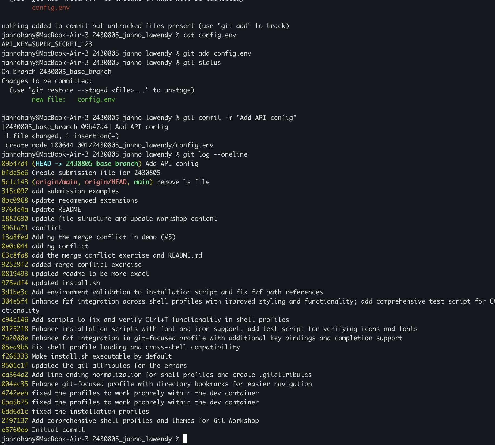
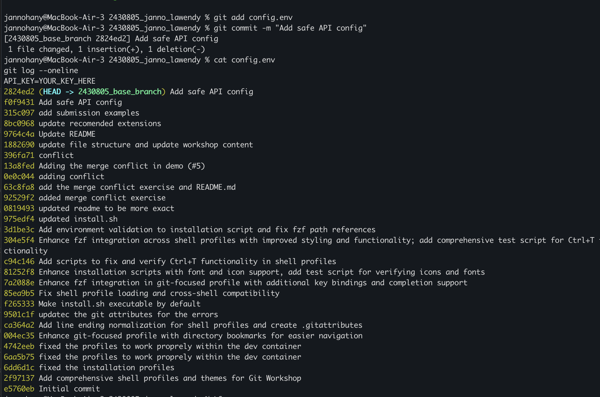
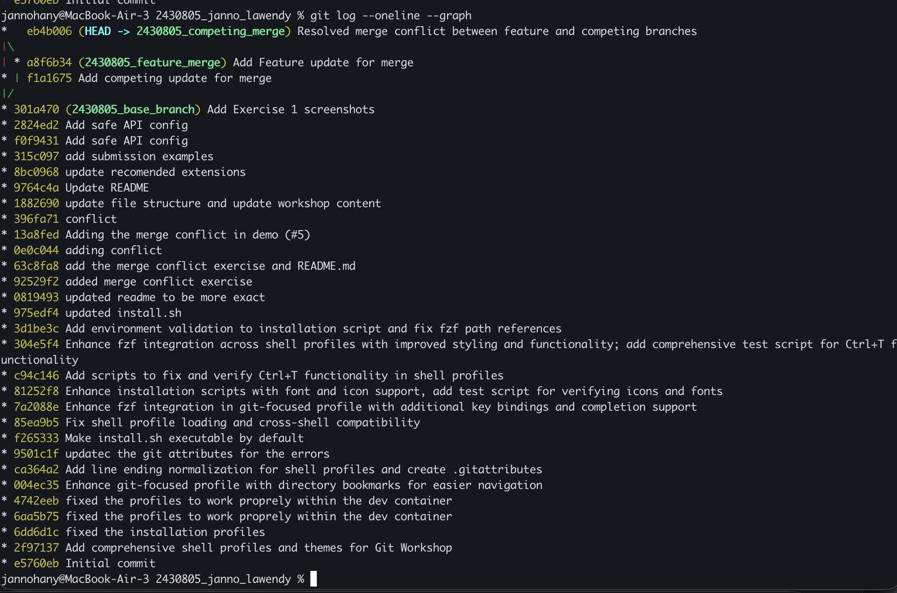
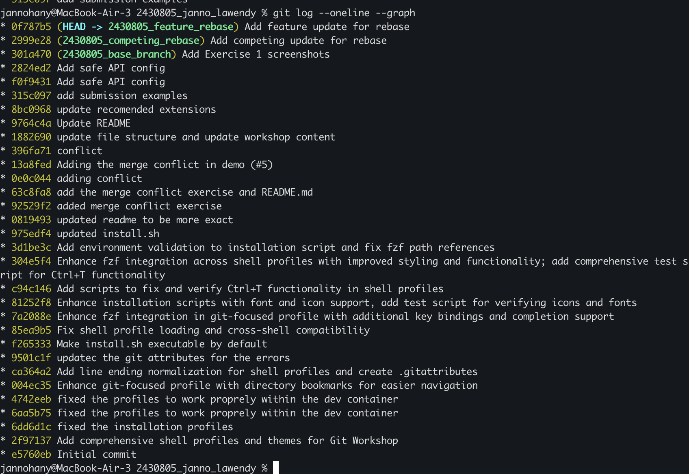
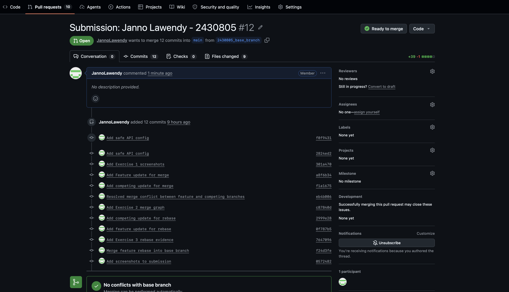

# Git Lab Submission

**Name:** [Janno Lawendy]
**Student ID:** [2430805]

## Exercise 1: Local Revert

**Screenshot of leaked secret in Git log:**

**Screenshot of clean Git log after soft reset:**

## Exercise 2: Merge Resolution

**Screenshot of merge commit graph:**

## Exercise 3: Rebase Resolution

**Original Feature Commit Hash:** `44279e2`  
**New Feature Commit Hash:** `0f787b5`

**Screenshot of rebased commit graph:**

## Exercise 4: Pull Request

**Screenshot of your opened Pull Request:**

