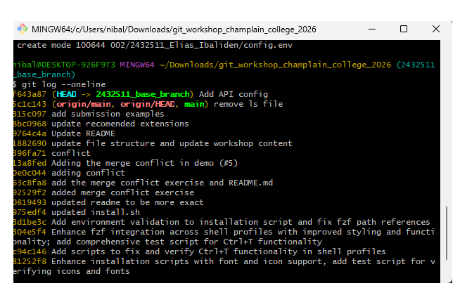
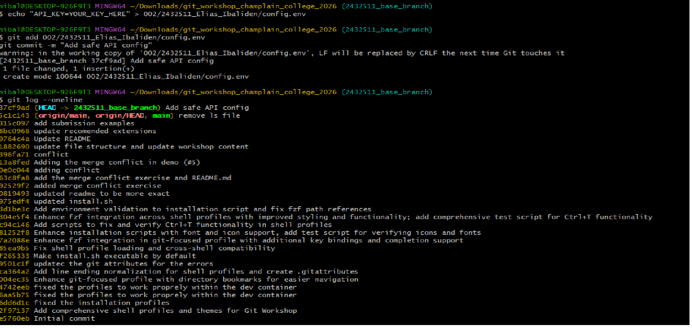
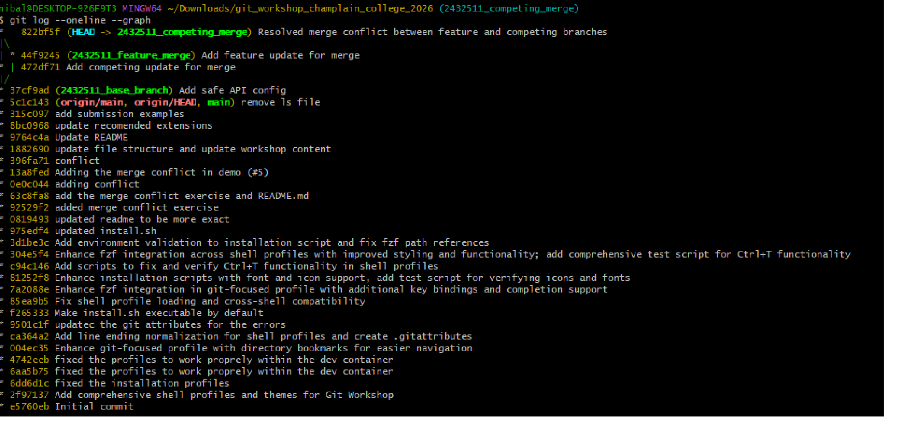
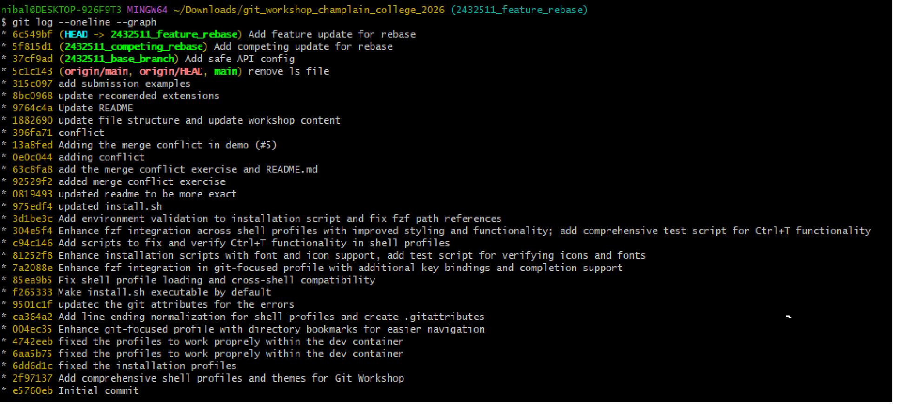
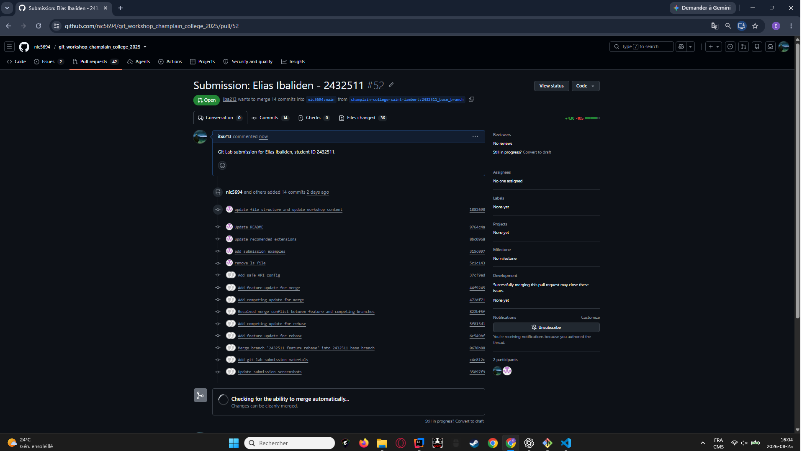

# Git Lab Submission

**Name:** Elias Ibaliden
**Student ID:** 2432511

## Exercise 1: Local Revert

**Screenshot of leaked secret in Git log:**

**Screenshot of clean Git log after soft reset:**

## Exercise 2: Merge Resolution

**Screenshot of merge commit graph:**

## Exercise 3: Rebase Resolution

**Original Feature Commit Hash:** `724e3b4`
**New Feature Commit Hash:** `6c549bf`

**Screenshot of rebased commit graph:**

## Exercise 4: Pull Request

**Screenshot of your opened Pull Request:**
