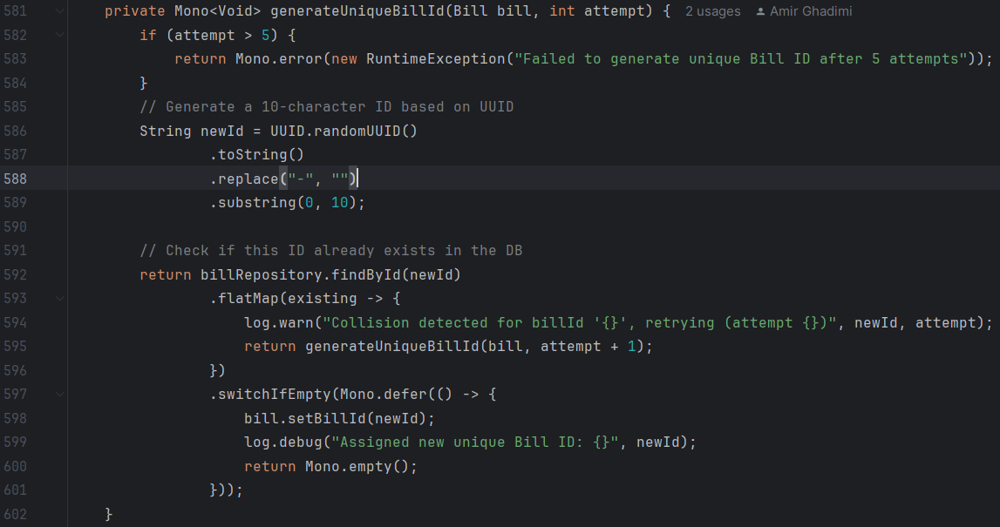
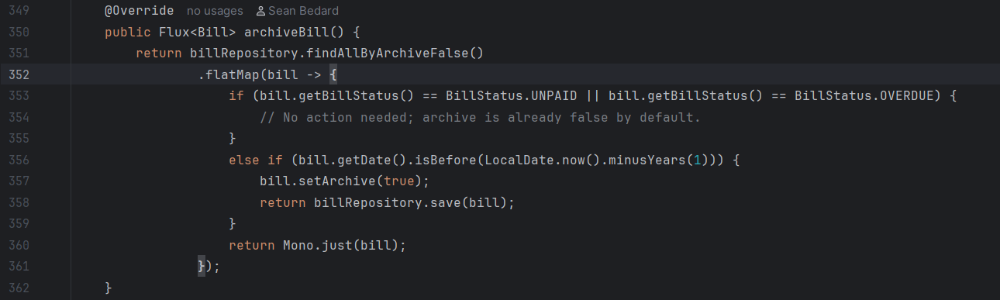
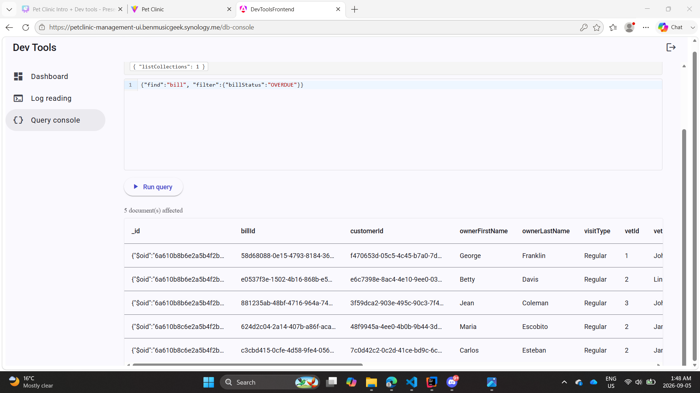
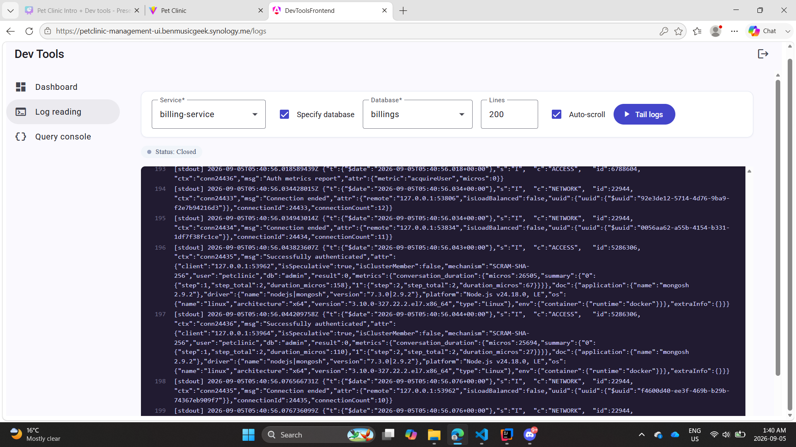

# Pet Clinic exploration Submission

**Name:** [Jesse John Dizon]

**Student ID:** [1530139]

**Pet Clinic Domain:** [Billing(BILL)]

## Exercise 1: Find a bug and a code smell or 3 code smells in your domain.

**Screenshot of the bug:**

**Small description of the bug:**
The newId is an altered UUID, it is being used in the billrepository.findById(newId) which should be findBillByBillId(newId)

> If you could not find a bug, remove the section above and duplicate the below section for each code smell.

**Screenshot of the code smell:**

**Small description of the code smell:**
The first if statement has a condition but does not return anything

## Exercise 2: Make a list of your domain's features.

**List of features:**

- Archive and view past Bills
- Change Currency on all Bills between CAD and USD
- Change Payment status of a Bill between UNPAID, PAID, and OVERDUE with corresponding colors

## Exercise 3: Run a query on your domain's main table.

**Screenshot of the query result:**

## Exercise 4: Look at the logs of your main service.

**Screenshot of logs:**

