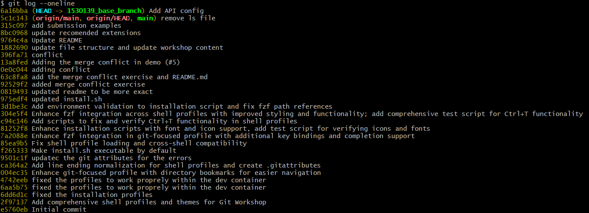
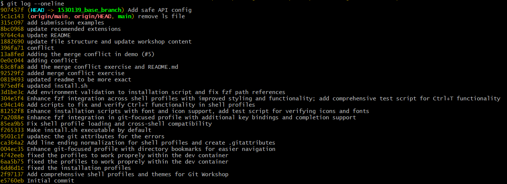
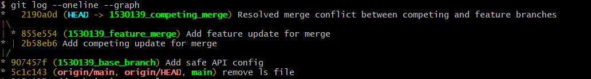
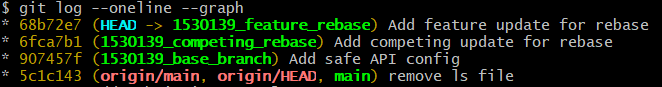

# Git Lab Submission

**Name:** [Jesse John Dizon]
**Student ID:** [1530139]

## Exercise 1: Local Revert

**Screenshot of leaked secret in Git log:**

**Screenshot of clean Git log after soft reset:**

## Exercise 2: Merge Resolution

**Screenshot of merge commit graph:**

## Exercise 3: Rebase Resolution

**Original Feature Commit Hash:** `[c2d5c67]`
**New Feature Commit Hash:** `[68b72e7]`

**Screenshot of rebased commit graph:**

## Exercise 4: Pull Request

**Screenshot of your opened Pull Request:**
