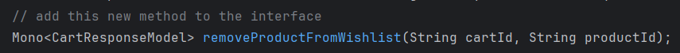
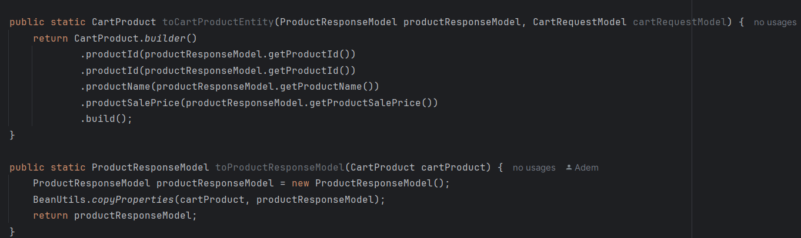
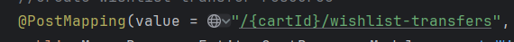
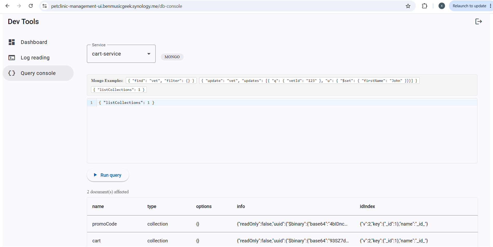
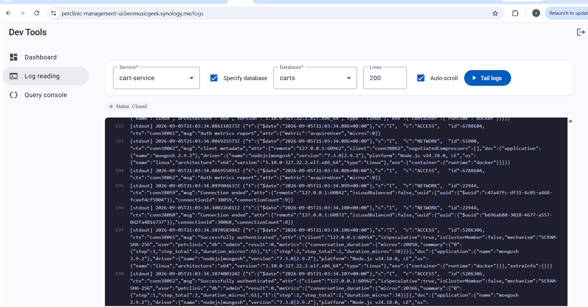

# Pet Clinic exploration Submission

**Name:** Xavier Bradley

**Student ID:** 1730298

**Pet Clinic Domain:** Carts
## Exercise 1: Find a bug and a code smell or 3 code smells in your domain.

"implement this later" comments shouldn't exist in the first place, but additionally the function was implemented but the comment was not removed 

multiple functions that have no implementations bogging down a large file (over 100 lines)

having the URL be /wishlist-transfers (as opposed to /wishlist/transfers) is inconsistent with the rest of the URLs defined and could be a source of confusion

## Exercise 2: Make a list of your domain's features.

**List of features:**

Shopping cart
Promotions/promo codes
Wishlist 

## Exercise 3: Run a query on your domain's main table.

## Exercise 4: Look at the logs of your main service.

