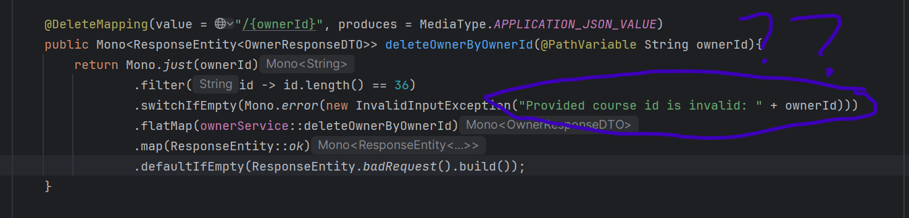
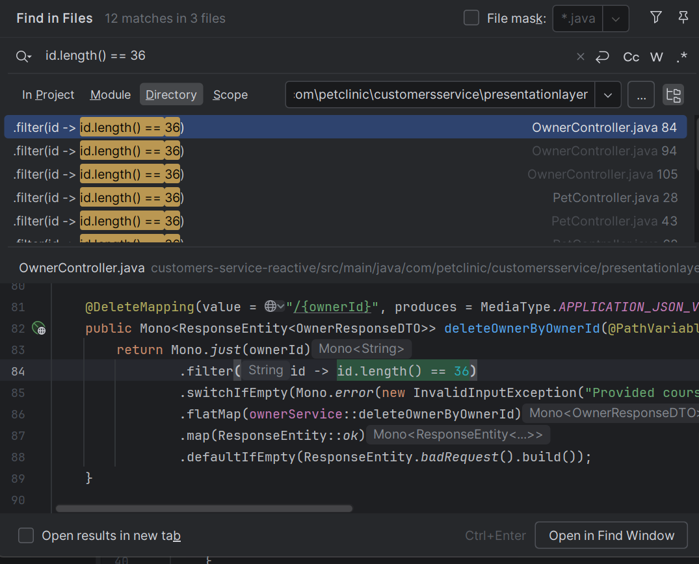
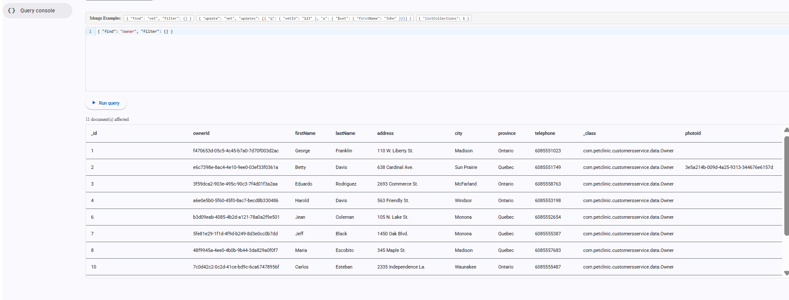
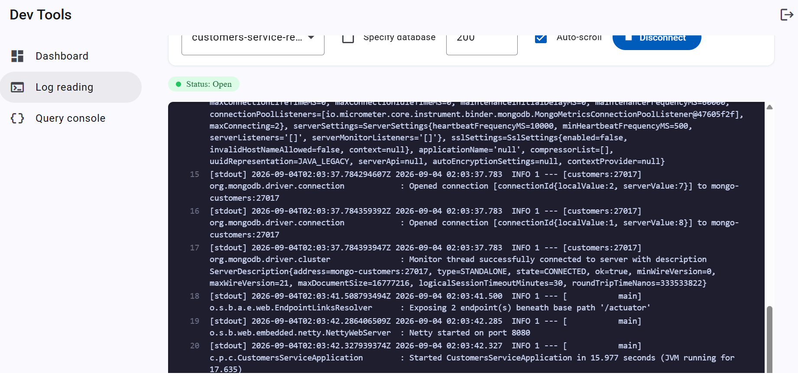

# Pet Clinic exploration Submission

**Name:** Alexandra Wintle

**Student ID:** 1731754

**Pet Clinic Domain:** Customer

## Exercise 1: Find a bug and a code smell or 3 code smells in your domain.

**Screenshot of the bug:**

**Small description of the bug:*its giving the wrong message when for calling/validating ownerId message says course id not owner*

> If you could not find a bug, remove the section above and duplicate the below section for each code smell.

**Screenshot of the code smell:**

**Small description of the code smell:*why is this same id.length() == 36 hard coded so many times its a lil redundant *

## Exercise 2: Make a list of your domain's features.

**List of features:**

- view all the owners
- add new owner
- update an owners photo and delete
- update an owner
- filter throguh owners
- view the total amount of owners

## Exercise 3: Run a query on your domain's main table.

**Screenshot of the query result:**

## Exercise 4: Look at the logs of your main service.

**Screenshot of logs:**
