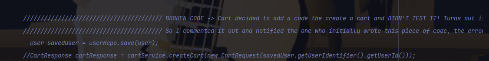
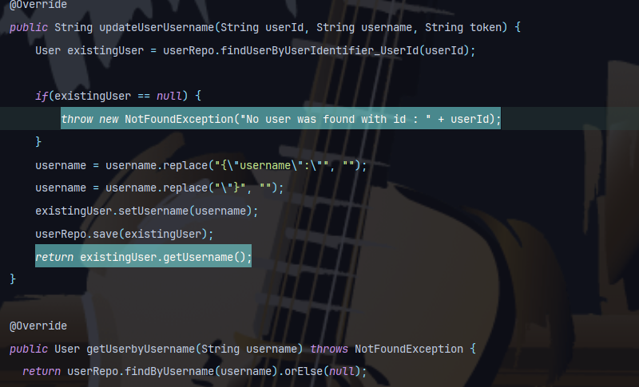
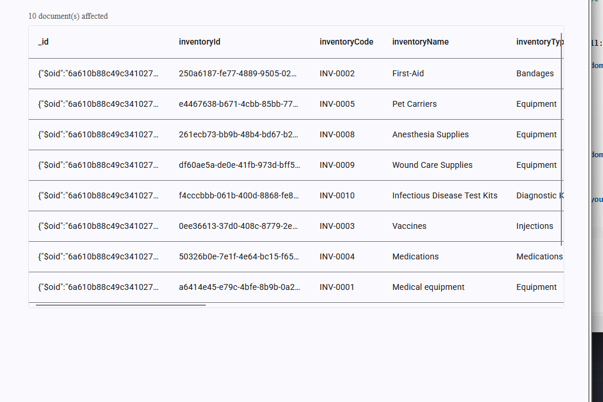
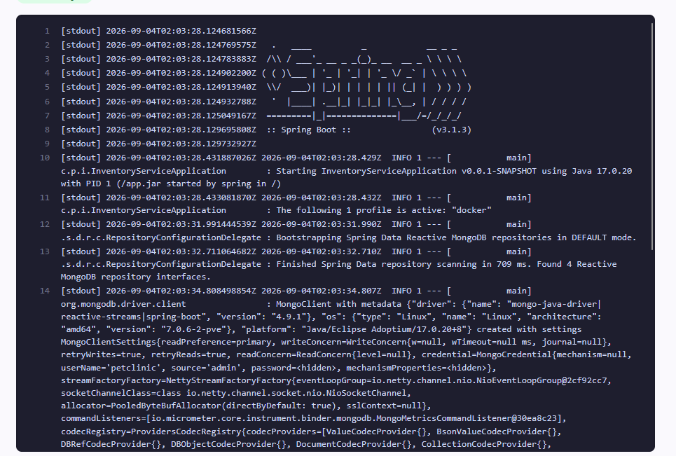

# Pet Clinic exploration Submission

**Name:** Malick Konate

**Student ID:** 2131590

**Pet Clinic Domain:** Inventory 

## Exercise 1: Find a bug and a code smell or 3 code smells in your domain.

**Screenshot of the bug:**

**Small description of the bug:**
This broke the entire sign-up flow, so the code was commented out rather than fixed. As a result, new users currently don't get a cart created automatically when they sign up

> If you could not find a bug, remove the section above and duplicate the below section for each code smell.

**Screenshot of the code smell:**

**Small description of the code smell:**
This indicates that raw, unparsed JSON is being passed into a field that should already be a plain string. Instead of fixing the root cause (proper request deserialization), the code patches the symptom with fragile string manipulation — if the JSON format changes even slightly, this will silently break or corrupt usernames
## Exercise 2: Make a list of your domain's features.

**List of features:**

- User registration (sign up) with email/username uniqueness validation
- Delete user accounts
- Update user profile information (username, email)

## Exercise 3: Run a query on your domain's main table.

**Screenshot of the query result:**

## Exercise 4: Look at the logs of your main service.

**Screenshot of logs:**
