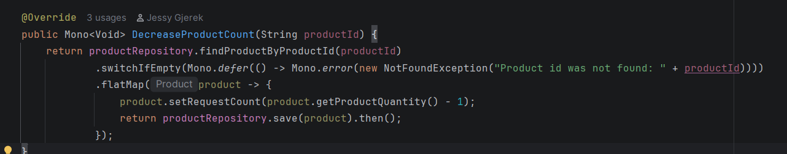
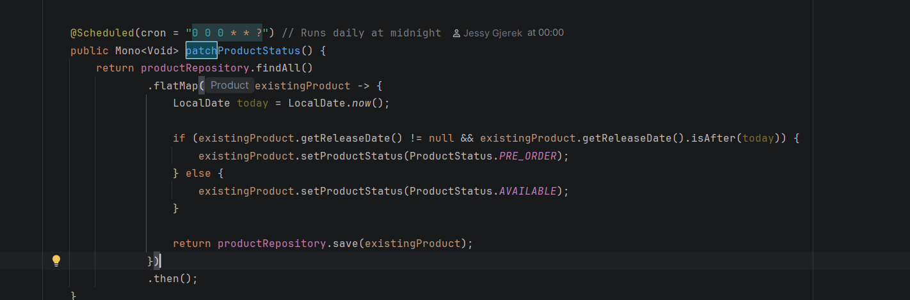
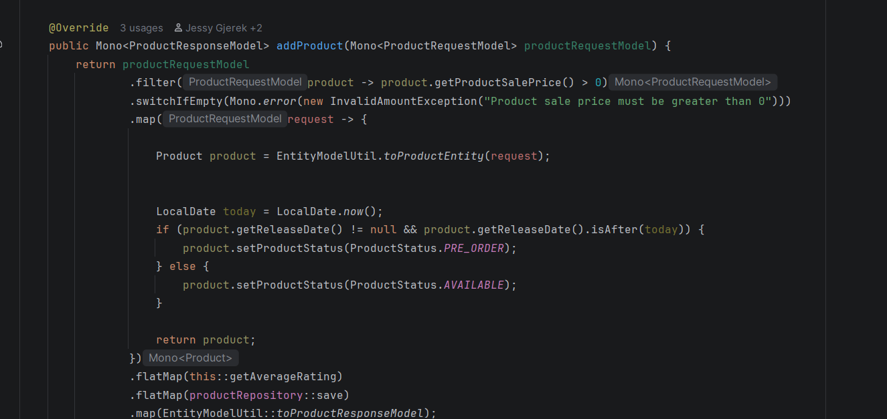
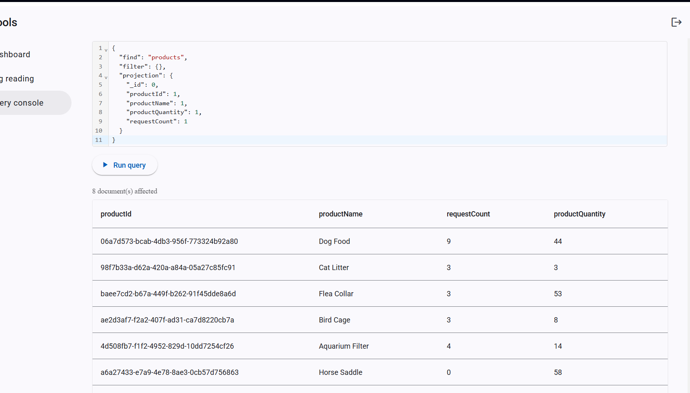
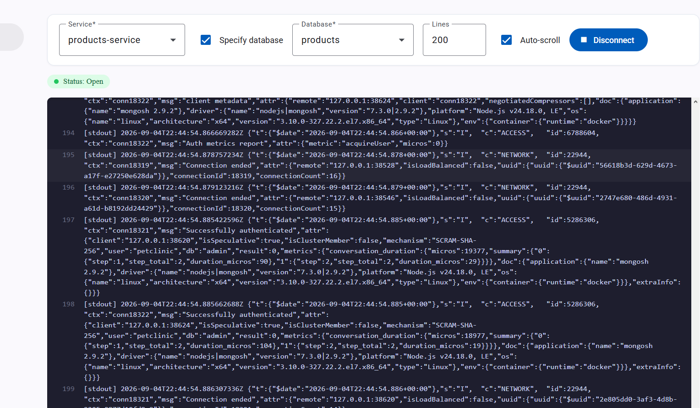

# Pet Clinic exploration Submission

**Name:** Michael Gentile

**Student ID:** 2331486

**Pet Clinic Domain:** Products

## Exercise 1: Find a bug and a code smell or 3 code smells in your domain.

**Screenshot of the bug:**

**Small description of the bug:**
The method sets the request count to product quantity - 1, then returns the product quantity
but the product quantity was never actually changed at all. 
AND they are setting the request count to something unrelated to what its currently at.

> If you could not find a bug, remove the section above and duplicate the below section for each code smell.

**Screenshot of the code smell:**

**Small description of the code smell:**
both of the methods have exactly the same code to check the date and set the Availability status. if they need to make a change they need to change both of the methods. this could be done in a helper method to limit the amount of changes that would be needed. 

## Exercise 2: Make a list of your domain's features.

**List of features:**

- feature 1
createProductBundle()
//this creates basically a list of items as a bundle that can be sold togther (i think)
- feature 2
resetRequestCount()
//this resets the number of requests every night at midnight
- feature 3
addProductType()
//this allows you to be able to make a new type of product

## Exercise 3: Run a query on your domain's main table.

**Screenshot of the query result:**

## Exercise 4: Look at the logs of your main service.

**Screenshot of logs:**

