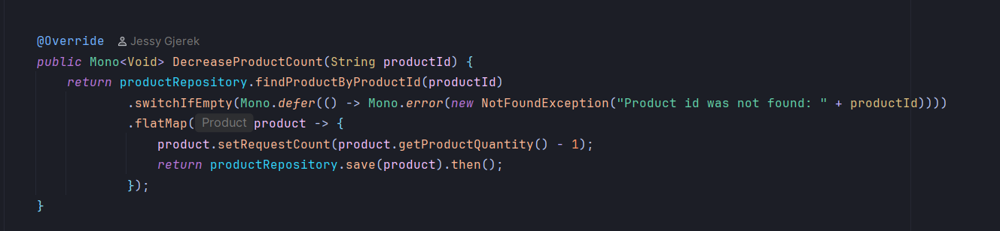
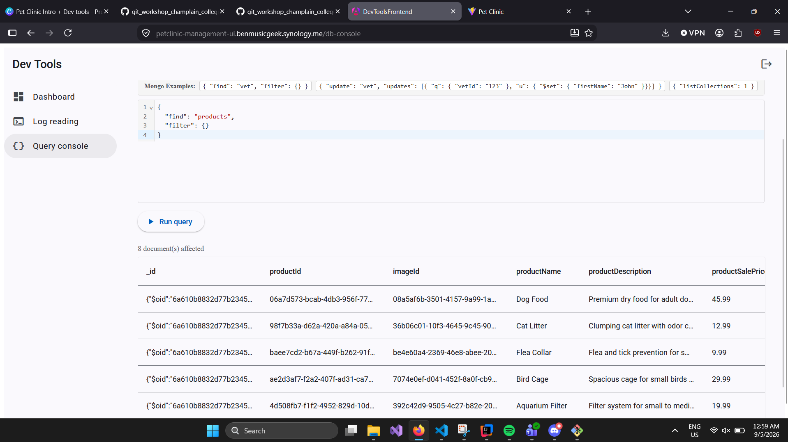
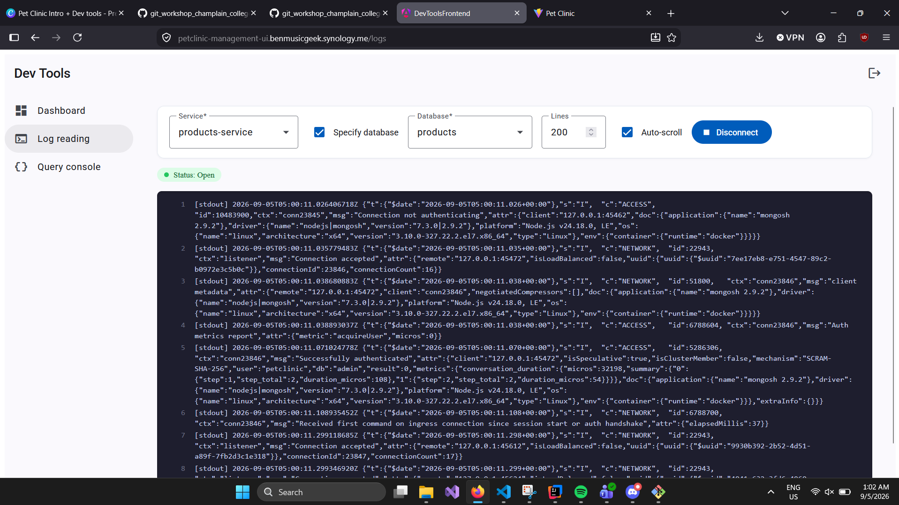

# Pet Clinic exploration Submission

**Name:** [Your Name]

**Student ID:** [Your ID]

**Pet Clinic Domain:** [Your Team Domain]

## Exercise 1: Find a bug and a code smell or 3 code smells in your domain.

**The DecreaseProductCount method is supposed to decrease the product quantity, but it updates the requestCount field instead. This means that using the decrease endpoint does not actually reduce the product's quantity.**

> If you could not find a bug, remove the section above and duplicate the below section for each code smell.

**:**

**The method DecreaseProductCount does not follow Java naming conventions because method names should begin with a lowercase letter. A clearer name would also describe that it decreases the product quantity**

## Exercise 2: Make a list of your domain's features.

**List of features:**

- View all products
- Add a new product
- update an existing product

## Exercise 3: Run a query on your domain's main table.

## Exercise 4: Look at the logs of your main service.

