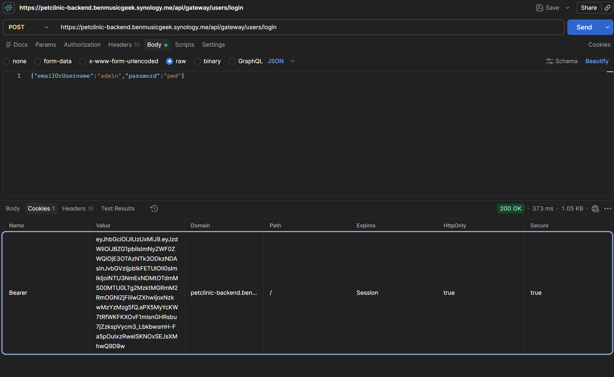
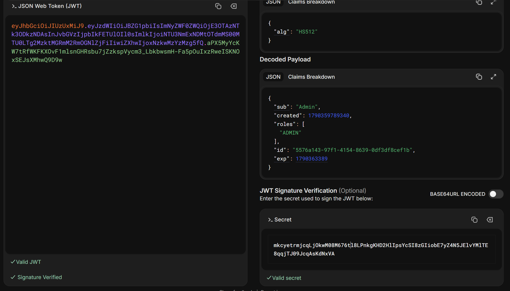

## Postman Request

The following screenshot shows the request sent through Postman, including the authentication details and response.

**Figure 1 — Postman Request**



## JWT Token

The JWT token generated during authentication is shown below:

```text
eyJhbGciOiJIUzUxMiJ9.eyJzdWIiOiJBZG1pbiIsImNyZWF0ZWQiOjE3OTAzNTk3ODkzNDAs
InJvbGVzIjpbIkFETUlOIl0sImlkIjoiNTU3NmExNDMtOTdmMS00MTU0LTg2MzktMGRmM2Rm
OGNlZjFiIiwiZXhwIjoxNzkwMzYzMzg5fQ.aPX5MyYcKW7tRfWKFKXOvF1mlsnGHRsbu7jZz
kspVycm3_LbkbwsmH-Fa5pOuIxzRweISKNOxSEJsXMhwQ9D9w
```

## Validated token:

**Figure 2 — JWT validator**



