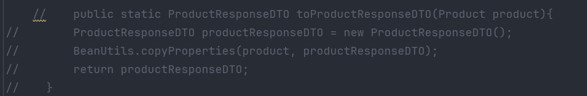
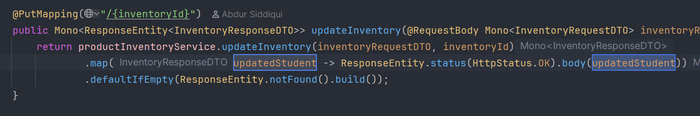
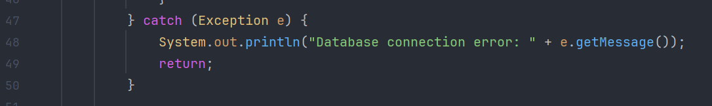
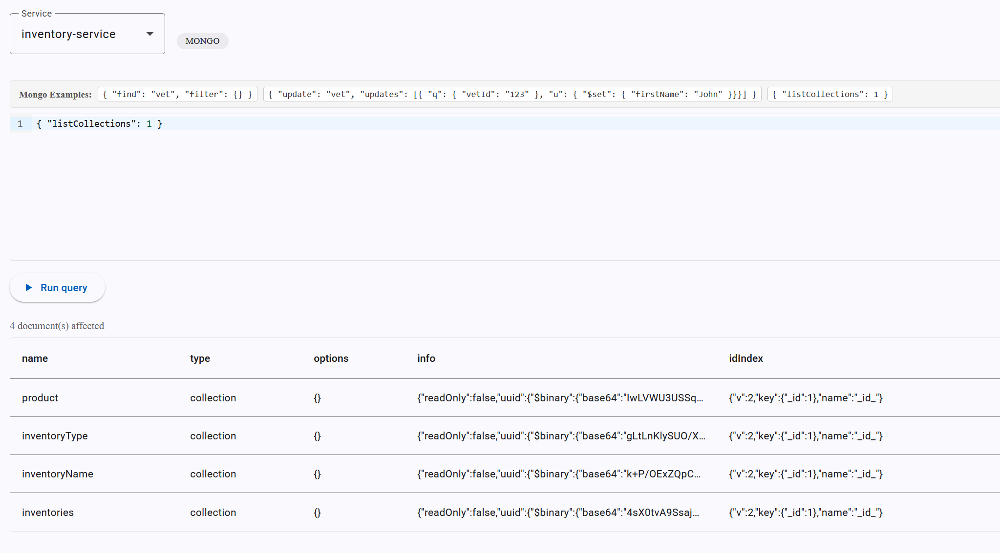
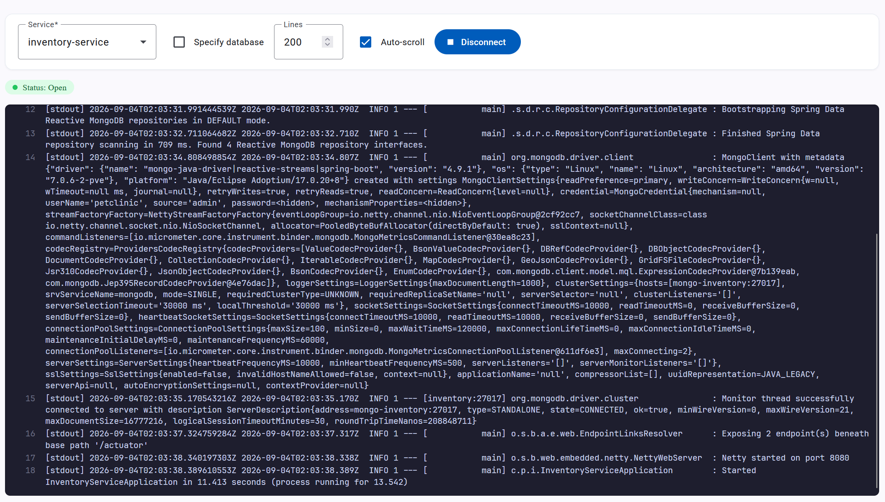

# Pet Clinic exploration Submission

**Name:** Dan Moraru

**Student ID:** 2431625

**Pet Clinic Domain:** Inventory

## Exercise 1: Find a bug and a code smell or 3 code smells in your domain.

**Screenshot of the code smell:**

**Small description of the code smell:**
A lot of code is commented out, but it is not clear if it should be removed, a todo or a fixme

**Screenshot of the code smell:**

**Small description of the code smell:**
The code contains wrong naming which means that the code was copy pasted from another service

**Screenshot of the code smell:**

**Small description of the code smell:**
Uses the println which isn't suitable for the rest of the project and hides information, should use SLF4J instead.

## Exercise 2: Make a list of your domain's features.

**List of features:**

- feature 1  
Product management within an inventory: add, update, retrieve (single/all), and delete products belonging to an inventory

- feature 2
Restocking: increase a product's quantity via a dedicated restock endpoint, and list products currently below a configurable low-stock threshold

- feature 3
Stock status tracking: derive a product's status (available / re-order / out of stock) from its quantity

## Exercise 3: Run a query on your domain's main table.
**Screenshot of the query result:**

## Exercise 4: Look at the logs of your main service.
**Screenshot of logs:**

