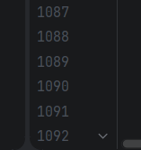
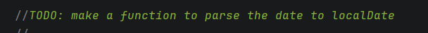
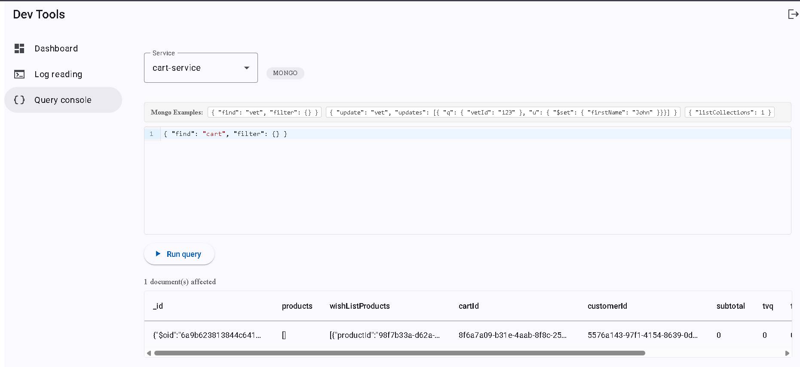
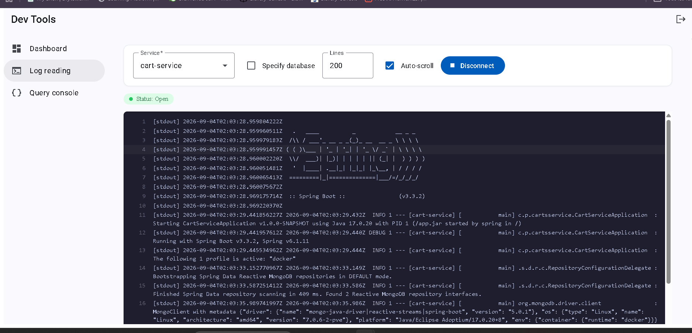

# Pet Clinic exploration Submission

**Name:** Yanis Achamou

**Student ID:** 2430325

**Pet Clinic Domain:** Carts

## Exercise 1: Find a bug and a code smell or 3 code smells in your domain.

> If you could not find a bug, remove the section above and duplicate the below section for each code smell.

**Screenshot of the code smell:**

**Small description of the code smell:**
A TODO comment was left in the codebase after the task was already completed.

**Screenshot of the code smell:**

**Small description of the code smell:**
This file has over 1000 lines long, which makes the class harder to read, maintain, and test.

**Screenshot of the code smell:**

**Small description of the code smell:**
There is a TODO comment saying a date parsing function still needs to be made.

## Exercise 2: Make a list of your domain's features.

**List of features:**

- feature 1
Cart management
- feature 2
Product cart actions
- feature 3
Wishlist and Product cart actions

## Exercise 3: Run a query on your domain's main table.

**Screenshot of the query result:**

## Exercise 4: Look at the logs of your main service.

**Screenshot of logs:**

