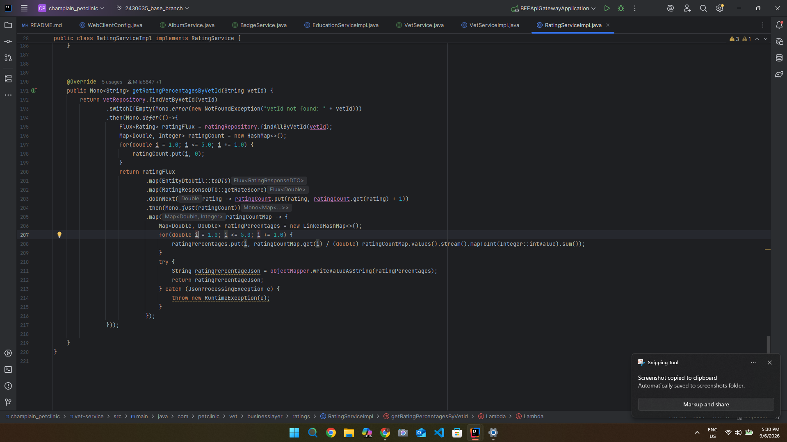
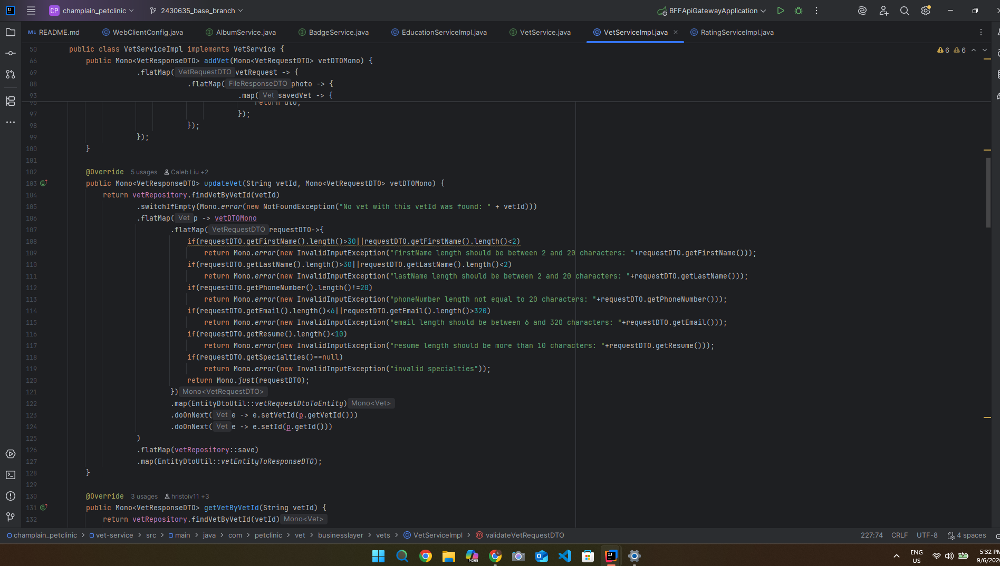
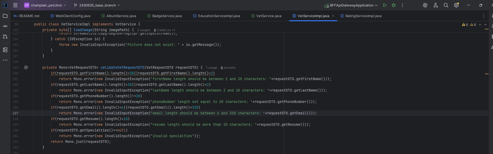
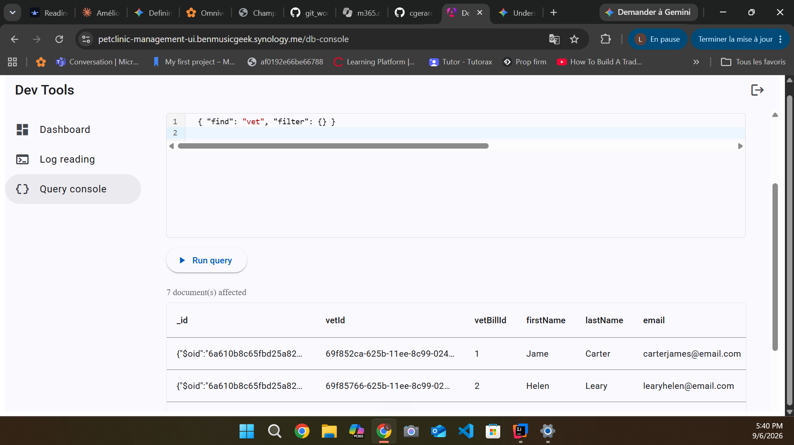
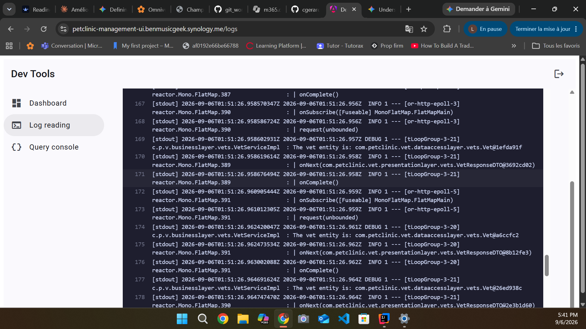

# Pet Clinic exploration Submission

**Name:** Loukmane Bessam

**Student ID:** 2430635
**Pet Clinic Domain:** [Your Team Domain]

## Exercise 1: Find a bug and a code smell or 3 code smells in your domain.

**Screenshot of the bug:**

**Small description of the bug:**
● Bug (line 208): When a vet has no ratings, the denominator .sum() is 0, so each percentage is calculated as 0 / 0.0 = NaN, which produces invalid JSON that the client can't parse.

> If you could not find a bug, remove the section above and duplicate the below section for each code smell.

**Screenshot of the code smell:**

**Small description of the code smell:**
the updateVet method re-implements the exact same 6 validation checks inline (lines 108–120) that already exist in the validateVetRequestDTO helper (lines 219–233), so the  
same rules are maintained in two places instead of one
## Exercise 2: Make a list of your domain's features.

**List of features:**

- feature 1
-  Vet management — create, update, retrieve, and deactivate veterinarians, including their specialties and profile photos
- feature 2
-  Ratings & reviews — customers rate vets (1–5), with average ratings, rating percentages, top-3 vets ranking, and filtering by yeart
- feature 3
  Vet profile content — supporting info like badges, education history, and photo albums for each vet (
## Exercise 3: Run a query on your domain's main table.
**Screenshot of the query result:**

## Exercise 4: Look at the logs of your main service.
cd
**Screenshot of logs:**
