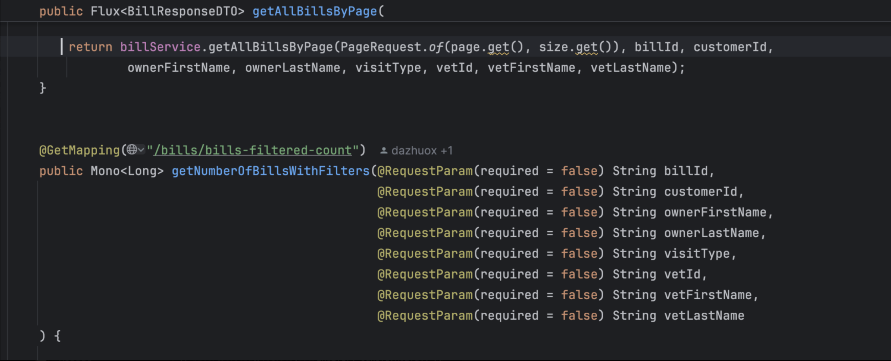
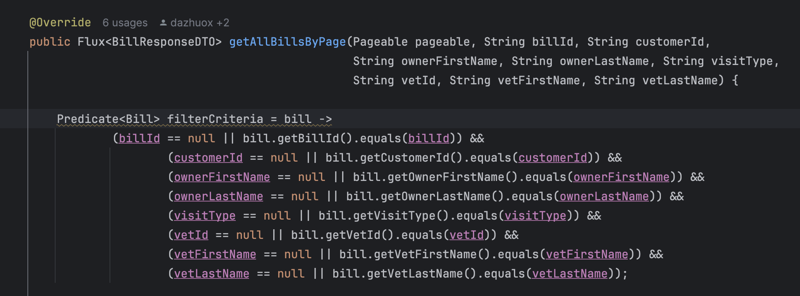
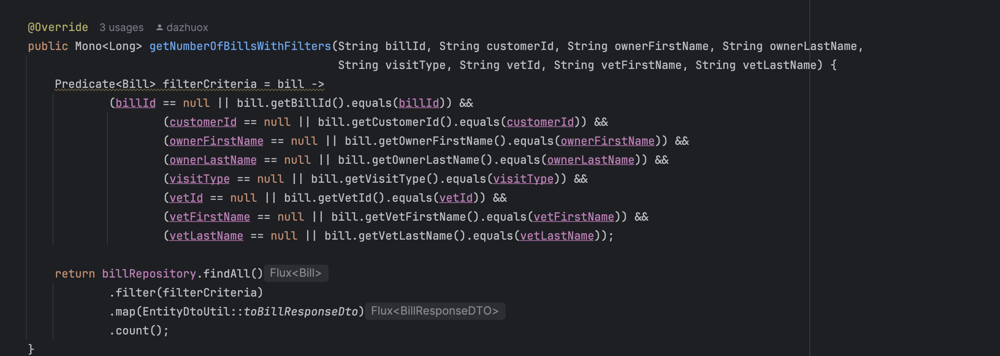
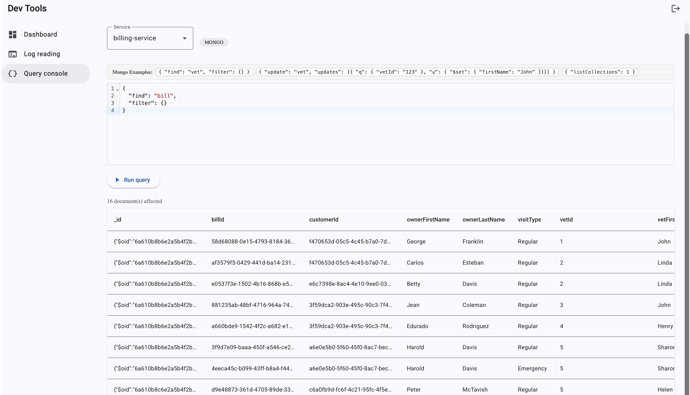
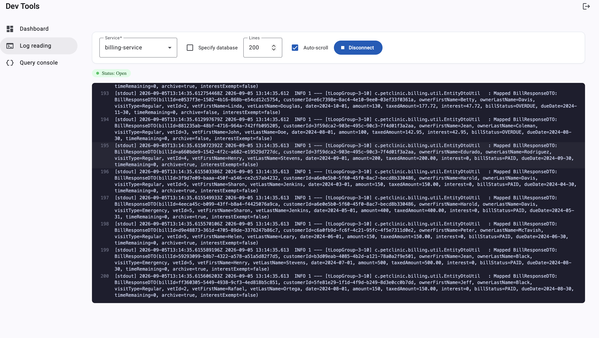

# Pet Clinic exploration Submission

**Name:** Janno Lawendy

**Student ID:** 2430805

**Pet Clinic Domain:** Billing

## Exercise 1: Find a bug and a code smell or 3 code smells in your domain.

**Screenshot of the bug:**

**Small description of the bug:**

It is an Unsafe Optional.get()

The page and size are optional, but the code uses .get() directly. If they are missing, the request can cause an error.

> If you could not find a bug, remove the section above and duplicate the below section for each code smell.

**Screenshot of the code smell:**

**Small description of the code smell:**
The same filtering code is written twice, once in `getAllBillsByPage()` and again in `getNumberOfBillsWithFilters()`. 
This makes the code harder to manage because any change would need to be made in both places.
It would be better to place the filtering code in one method and reuse it.
## Exercise 2: Make a list of your domain's features.

**List of features:**

- Create a bill for an owner after their pet visits the clinic.
- Find and view a bill using its ID.
- Link a bill to the right pet owner and veterinarian.
- Search and filter bills by owner name, vet name, visit type, or payment status.

## Exercise 3: Run a query on your domain's main table.

**Screenshot of the query result:**

## Exercise 4: Look at the logs of your main service.

**Screenshot of logs:**

