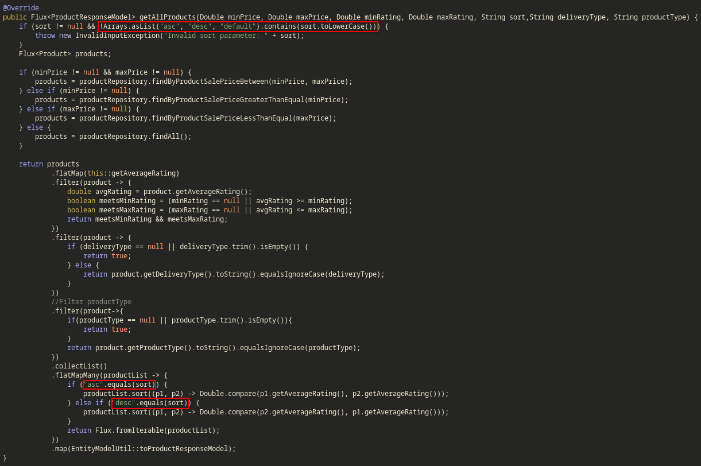
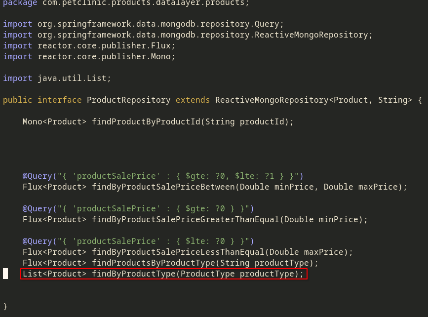
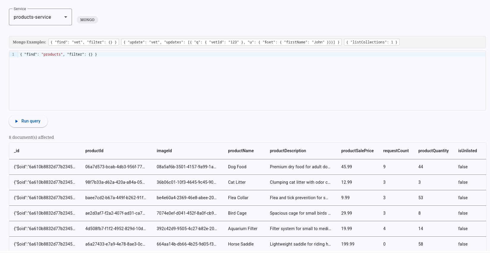
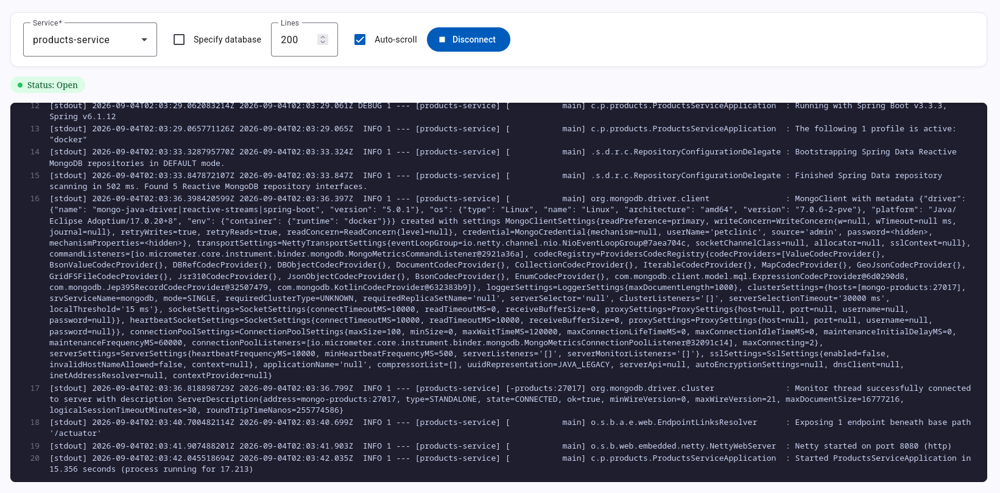

# Pet Clinic exploration Submission

**Name:** Nathan Bessette

**Student ID:** 2430884

**Pet Clinic Domain:** Product

## Exercise 1: Find a bug and a code smell or 3 code smells in your domain.

**Screenshot of the bug:** 

**Small description of the bug:**
`sort` is converted to lowercase to check if the filter is correct in the first if statment, but later `sort` is compared without being convert to lower case.

**Screenshot of the code smell:** 

**Small description of the code smell:**
A List is used instead of a Flux which is blocking and does not respect Reactive Programming.

## Exercise 2: Make a list of your domain's features.

**List of features:**

- Product Catalog
- Product Bundles
- Rating/Reviews

## Exercise 3: Run a query on your domain's main table.

**Screenshot of the query result:** 

## Exercise 4: Look at the logs of your main service.

**Screenshot of logs:** 
