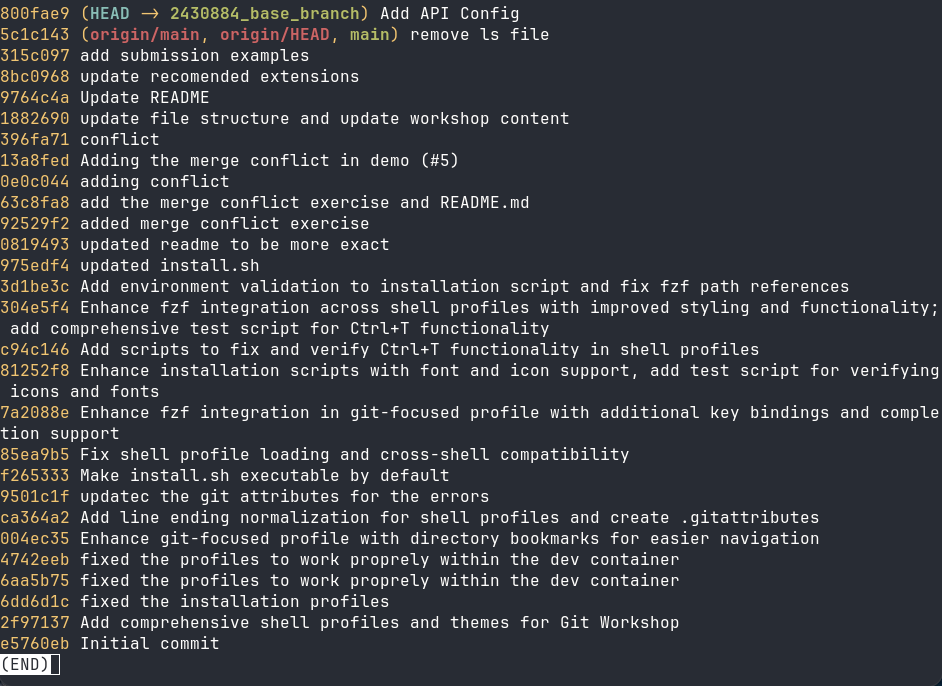
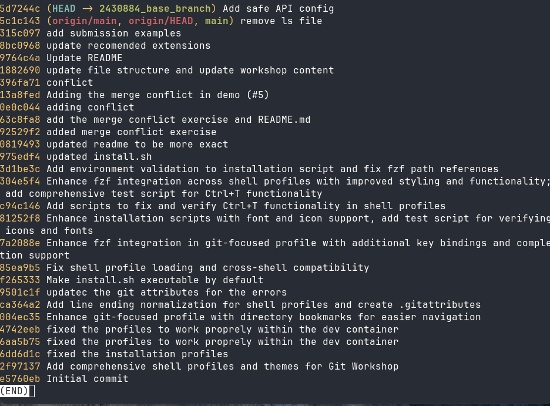
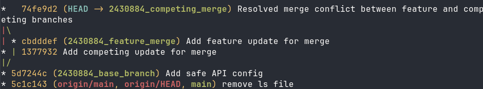
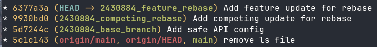
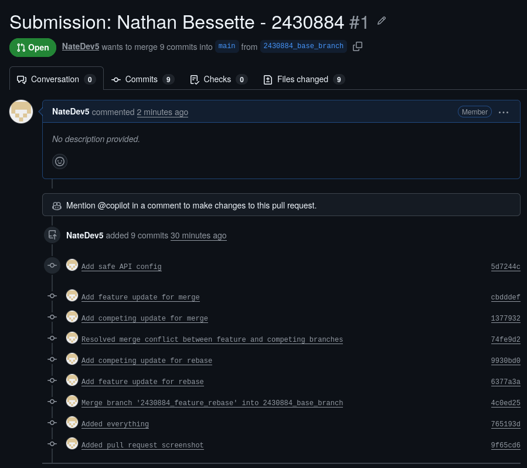

# Git Lab Submission

**Name:** Nathan Bessette
**Student ID:** 2430884

## Exercise 1: Local Revert

**Screenshot of leaked secret in Git log:**

**Screenshot of clean Git log after soft reset:**

## Exercise 2: Merge Resolution

**Screenshot of merge commit graph:**

## Exercise 3: Rebase Resolution
**Original Feature Commit Hash:** `11e34cd`
**New Feature Commit Hash:** `6377a3a`

**Screenshot of rebased commit graph:**

## Exercise 4: Pull Request

**Screenshot of your opened Pull Request:**

