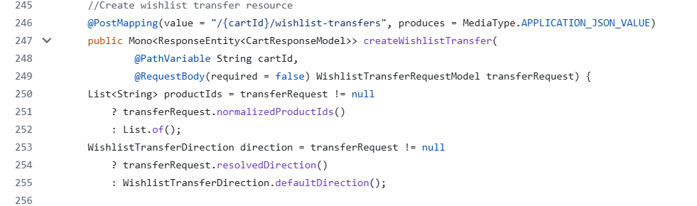
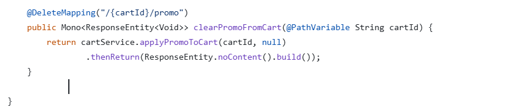
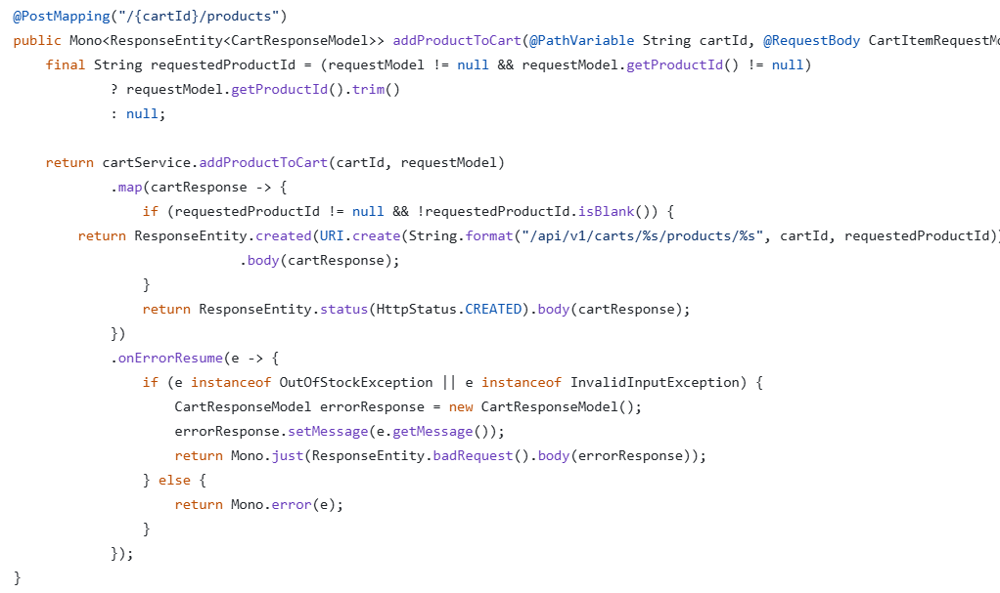
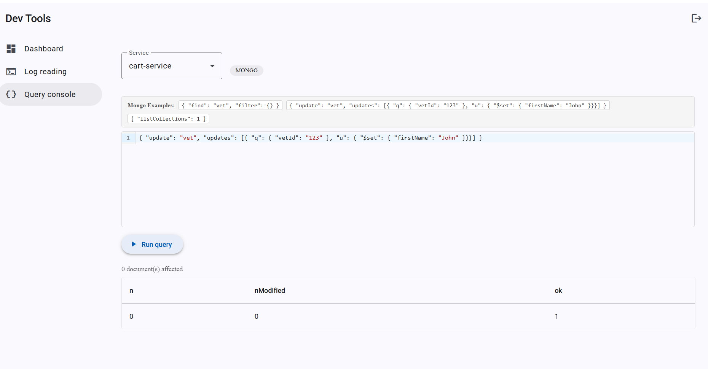
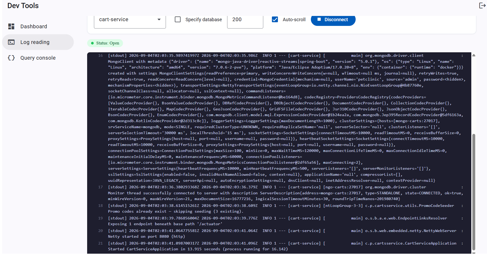

# Pet Clinic exploration Submission

**Name:** Agnesa Verenceanu

**Student ID:** 2431197

**Pet Clinic Domain:** Carts

## Exercise 1: Find a bug and a code smell or 3 code smells in your domain.
> If you could not find a bug, remove the section above and duplicate the below section for each code smell.

**Screenshot of the code smell:**

**Small description of the code smell:**
The comment should have been taken out since the method has already been implemented. 

**Screenshot of the code smell:**

**Small description of the code smell:**
First, the code doesn't check for a valid cartId. Second, it wouldn't handle an empty statement which might cause errors in the output. 

**Screenshot of the code smell:**

**Small description of the code smell:**
The cartId was never valided here and there is not exception in case the Id is wrong. 

## Exercise 2: Make a list of your domain's features.

**List of features:**

- feature 1: The customer can manage their wishlist. 
- feature 2: The customer can apply a promo code. 
- feature 3: With the tracked history, the customer is able to see the recommended products based on history.  

## Exercise 3: Run a query on your domain's main table.

**Screenshot of the query result:**

## Exercise 4: Look at the logs of your main service.

**Screenshot of logs:**
