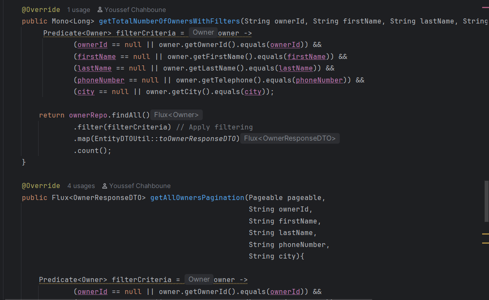
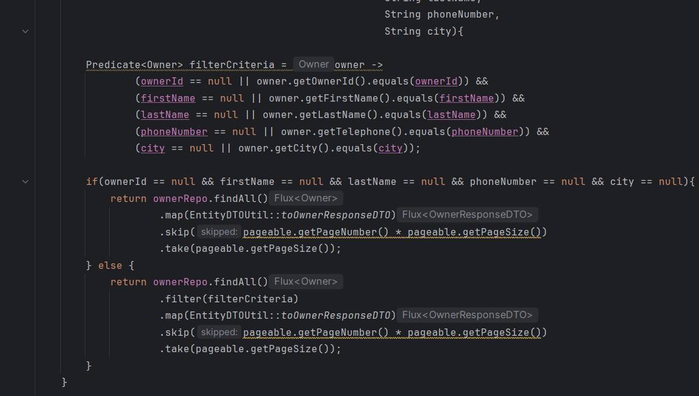
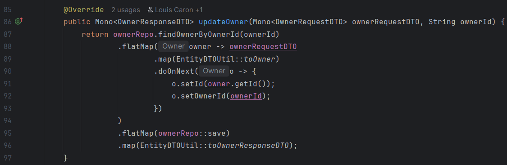
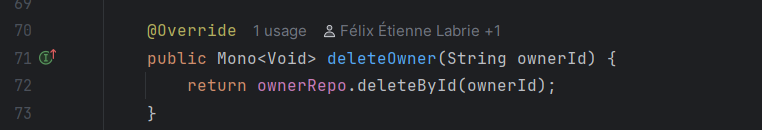
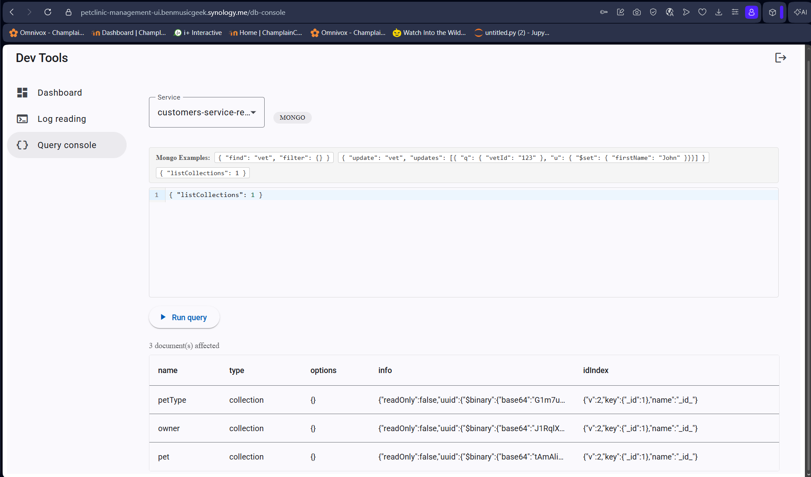
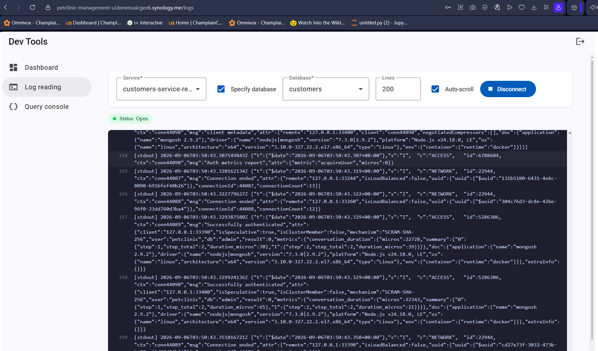

# Pet Clinic Exploration Submission

**Name:** Yacoub Bakayoko

**Student ID:** 2431671

**Pet Clinic Domain:** Customers — customers-service-reactive

## Exercise 1: Find a bug and a code smell or 3 code smells in your domain.

**Screenshot of code smell #1:**

**Code smell #1:** The `filterCriteria` predicate logic is duplicated in two places instead of being extracted into one reusable method, violating the DRY principle.

**Screenshot of code smell #2:**

**Code smell #2:** The `updateOwner` method doesn't handle the case where the owner doesn't exist, since it's missing a `switchIfEmpty`/error check.

**Screenshot of code smell #3:**

**Code smell #3:** The `deleteOwner` method in `OwnerServiceImpl` is dead code from the API's perspective — no REST controller endpoint calls it, even though the IDE shows one internal usage elsewhere in the codebase.

## Exercise 2: Make a list of your domain's features.

**List of features:**

- **Owner CRUD:** Create, view, update, and delete owner records through the REST API.
- **Search and pagination:** List and search owners with pagination and filtering by id, name, phone, or city.
- **Pet CRUD:** Create, view, update, and delete pet records linked to an owner.

## Exercise 3: Run a query on your domain's main table.

**Screenshot of the query result:**

## Exercise 4: Look at the logs of your main service.

**Screenshot of logs:**

