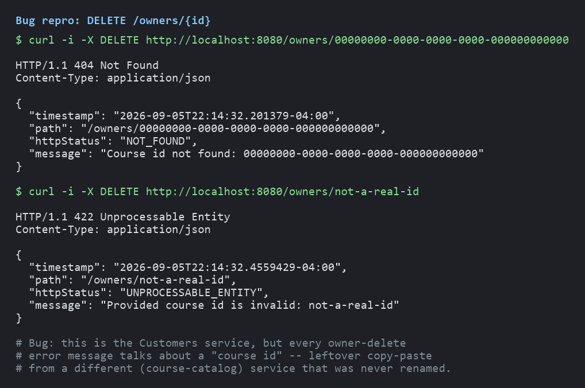
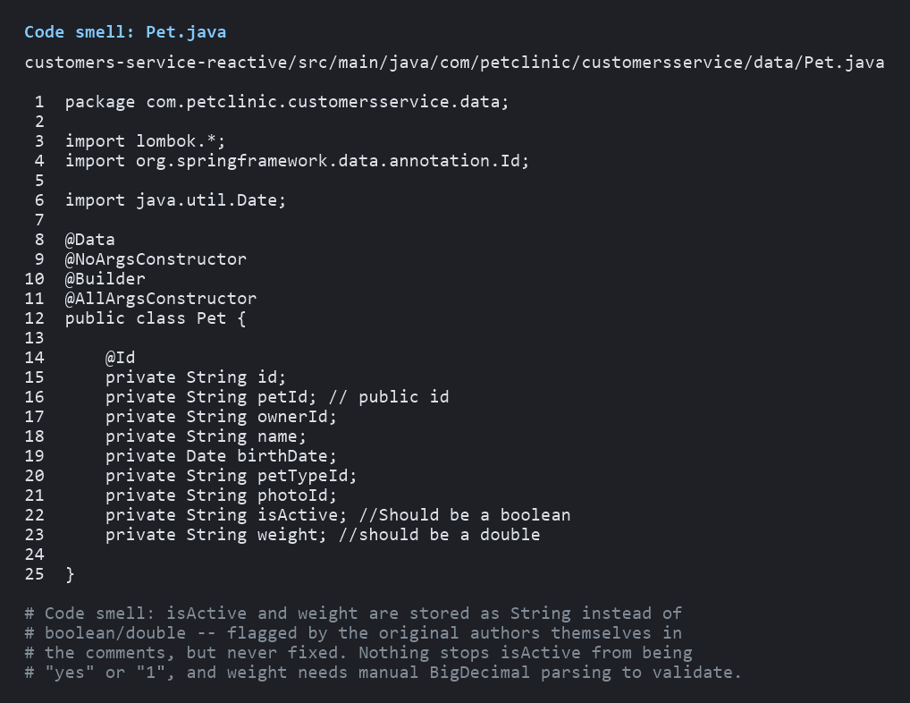
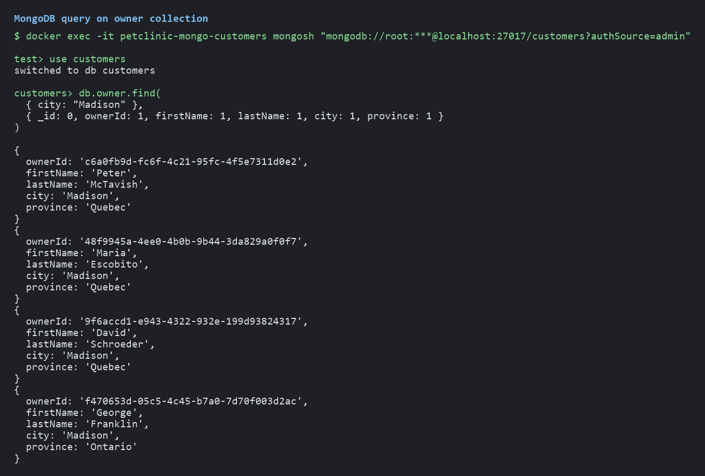
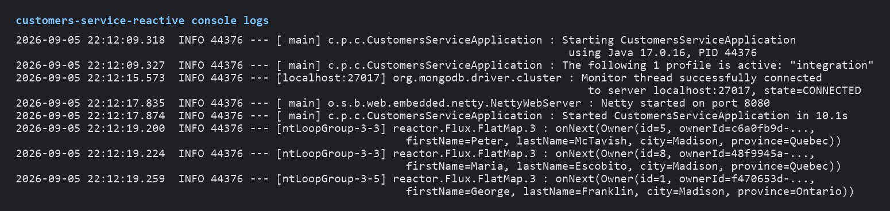

# Pet Clinic Exploration Submission

**Name:** Yacoub Bakayoko

**Student ID:** 2431671

**Pet Clinic Domain:** Customers — customers-service-reactive

## Exercise 1: Find a bug and a code smell or 3 code smells in your domain.

**Screenshot of the bug:**

**Small description of the bug:**

The delete-owner endpoint returns error messages copy-pasted from an unrelated "course" domain instead of "owner." In `OwnerController.java` (delete endpoint) the code throws `new InvalidInputException("Provided course id is invalid: " + ownerId)` instead of reusing the existing `ApplicationExceptions.invalidOwnerId(ownerId)` helper (which correctly says "Owner id ... is invalid"), and `OwnerServiceImpl.deleteOwnerByOwnerId` throws `new NotFoundException("Course id not found: " + ownerId)`. As a result, calling `DELETE /owners/{id}` with an invalid or nonexistent owner ID returns a message about a "course id" instead of an "owner id" — leftover copy-paste from a different service that was never renamed. Verified live against a running instance of the service (screenshot above is the real HTTP response).

**Screenshot of the code smell:**

**Small description of the code smell:**

The `Pet` entity stores `isActive` and `weight` as `String` fields instead of `boolean` and `double` (the original developers even flagged this in comments: `// Should be a boolean` and `// should be a double`). This is a primitive-obsession smell: nothing stops `isActive` from holding an invalid value like `"yes"`, and `weight` has to be manually parsed/validated with a try-catch around `BigDecimal` parsing (`Validator.validWeight()`) instead of being guaranteed numeric by the type system.

## Exercise 2: Make a list of your domain's features.

**List of features:**

- Create, view, update, and delete owners
- List/search owners with pagination, filtering (by id, name, phone, city), and count endpoints
- Upload, update, and delete an owner's photo
- Create, view, update, and delete pets
- List all pets belonging to a given owner
- Toggle a pet's active/inactive status
- Upload and delete a pet's photo
- Create and view pet types (species/category, with name and description)

## Exercise 3: Run a query on your domain's main table.

**Screenshot of the query result:**

## Exercise 4: Look at the logs of your main service.

**Screenshot of logs:**

