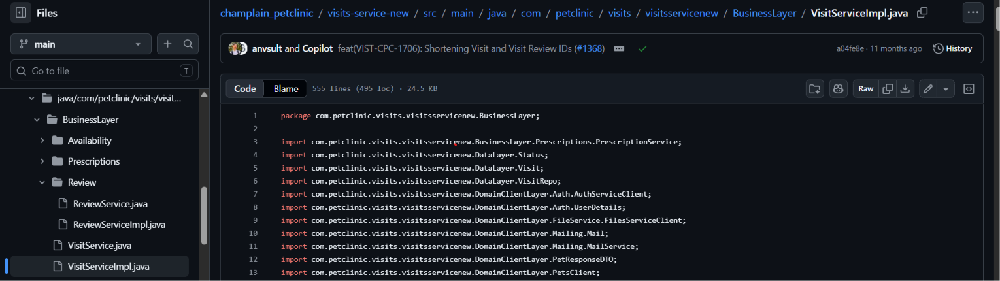
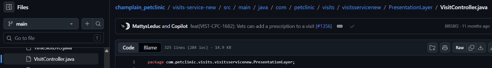
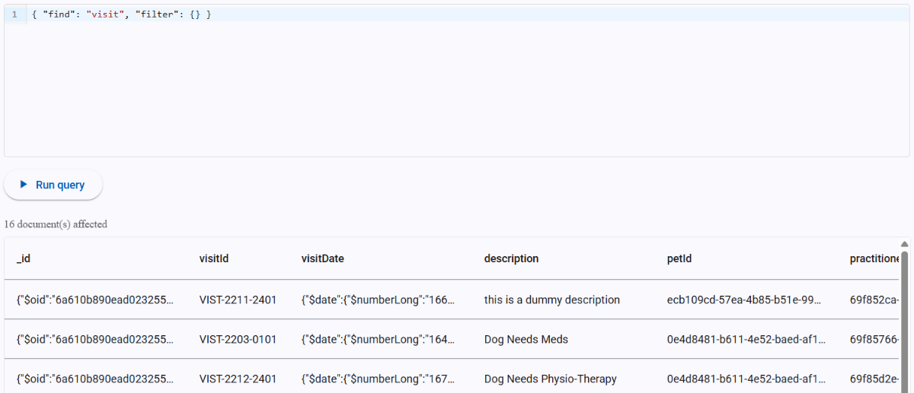
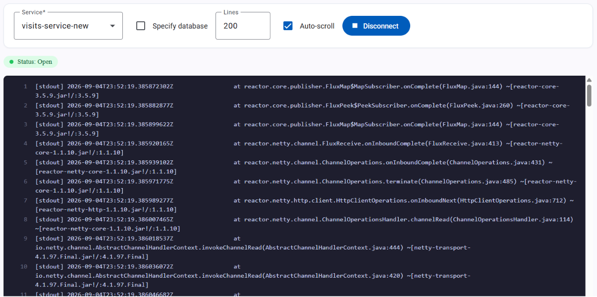

# Pet Clinic exploration Submission

**Name:** Luis Enrique Rodriguez Corea

**Student ID:** 2432060

**Pet Clinic Domain:** Visits (VIST)

## Exercise 1: Find a bug and a code smell or 3 code smells in your domain.

**Screenshot of the code smell:**

**Small description of the code smell:**

File is very big (>500 lines)

**Screenshot of the code smell:**

**Small description of the code smell:**

File is very big (>300 lines)

**Screenshot of the code smell:**

**Small description of the code smell:**

File is very big (>1000 lines)

## Exercise 2: Make a list of your domain's features.

**List of features:**

- feature 1: Create, Update and Delete visits.
- feature 2: Retrieve visit history for a specific pet or vet.
- feature 3: Add a note to specific visits.

## Exercise 3: Run a query on your domain's main table.

**Screenshot of the query result:**

## Exercise 4: Look at the logs of your main service.

**Screenshot of logs:**

