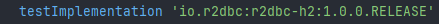
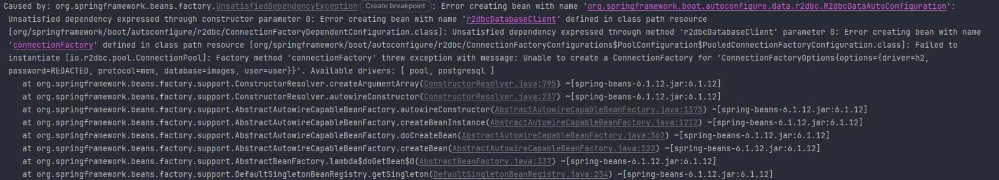
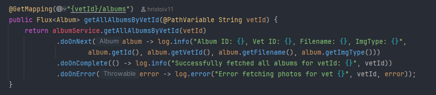
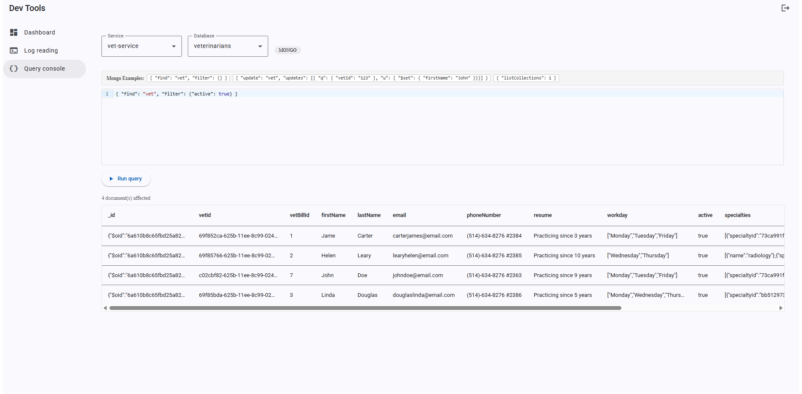
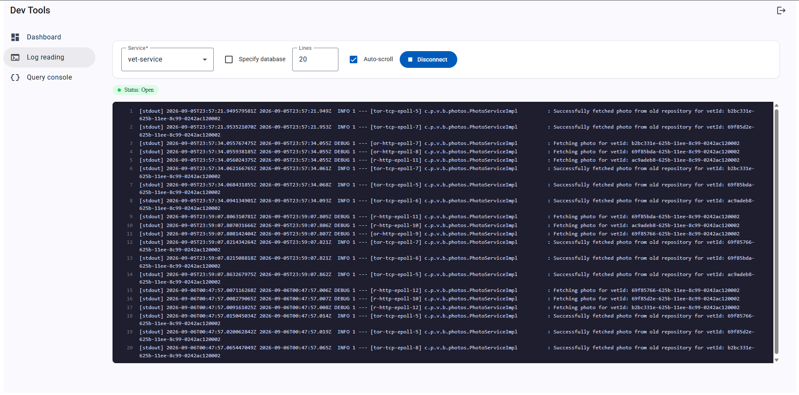

# Pet Clinic exploration Submission

**Name:** Saurya Tatineni

**Student ID:** 2432486

**Pet Clinic Domain:** Veterinarians (VETS)

## Exercise 1: Find a bug and a code smell or 3 code smells in your domain.

**Screenshot of the bug:**

**Small description of the bug:** The application crashes on startup because the H2 driver used by the default profile is only included for tests and not for running the app.

> If you could not find a bug, remove the section above and duplicate the below section for each code smell.

**Screenshot of the code smell:**

**Small description of the code smell:** The Album entity is exposed directly instead of using a DTO (AlbumResponseDTO is never used).
Every other resource in VetController return a DTO but the album endpoint return the entity.

## Exercise 2: Make a list of your domain's features.

**List of features:**

- feature 1: The app automatically detects a photo's image type from its filename
- feature 2: The app can look up a vet by their billing ID instead of their normal ID
- feature 3: The app can calculate and return a vet's average rating

## Exercise 3: Run a query on your domain's main table.

**Screenshot of the query result:**

## Exercise 4: Look at the logs of your main service.

**Screenshot of logs:**
