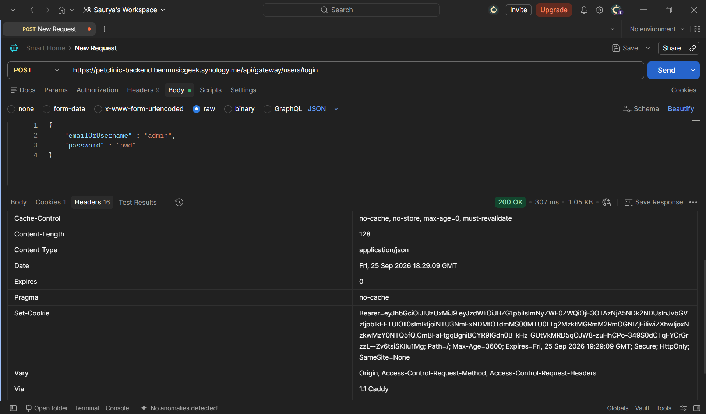
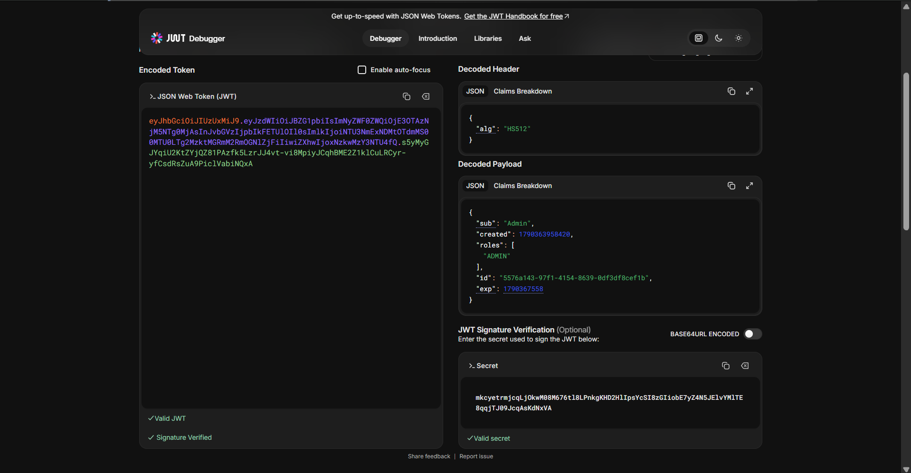

**Figure 1 — Postman Request**

## JWT Token

The JWT token generated during authentication is shown below:
text
eyJhbGciOiJIUzUxMiJ9.eyJzdWIiOiJBZG1pbiIsImNyZWF0ZWQiOjE3OTAzNjM5NTg
0MjAsInJvbGVzIjpbIkFETUlOIl0sImlkIjoiNTU3NmExNDMtOTdmMS00MTU0LTg2Mzk
tMGRmM2RmOGNlZjFiIiwiZXhwIjoxNzkwMzY3NTU4fQ.s5yMyGJYqiU2KtZYjQZ81PAz
fk5LzrJJ4vt-vi8MpiyJCqhBME2Z1klCuLRCyr-yfCsdRsZuA9PiclVabiNQxA
## Validated token:

**Figure 2 — JWT validator**

