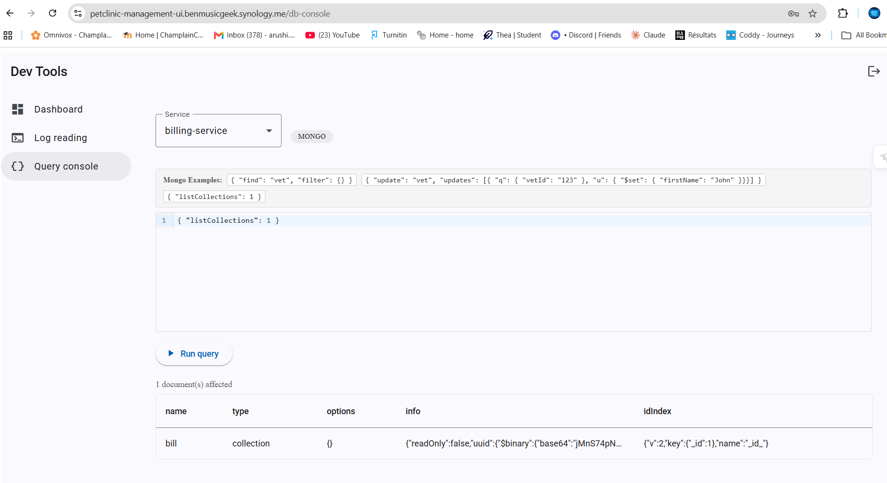
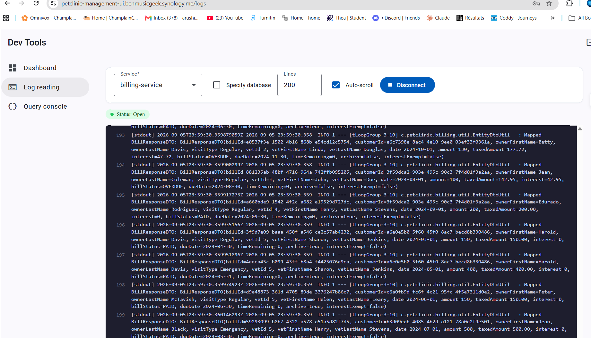

# Pet Clinic exploration Submission

**Name:** [Arushi Naik]

**Student ID:** [2432645]

**Pet Clinic Domain:** [Billing(Bills)]

## Exercise 1: Find a bug and a code smell 
**Screenshot of the bug:**

**Small description of the bug:**
The BillController has two methods using the same GET /bills endpoint. This creates a duplicate endpoint mapping, which can cause conflicts when the application tries to decide which method should handle the request.

> If you could not find a bug, remove the section above and duplicate the below section for each code smell.

**Screenshot of the code smell:**

**Small description of the code smell:**
The BillServiceImpl class is very large, with around 640 lines of code. It contains many different responsibilities, such as creating bills, processing payments, calculating interest, generating PDFs, and sending emails. This makes the class harder to understand, maintain, and test.

## Exercise 2: Make a list of your domain's features.

**List of features:**

- Filter and paginate bills
- Manage bill status (PAID, UNPAID, and OVERDUE)
- Calculate bill interest

## Exercise 3: Run a query on your domain's main table.

**Screenshot of the query result:**

## Exercise 4: Look at the logs of your main service.

**Screenshot of logs:**

