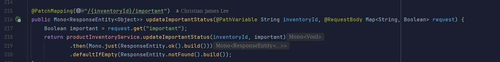
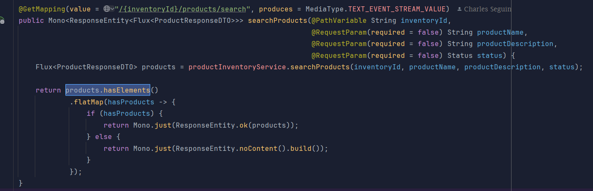
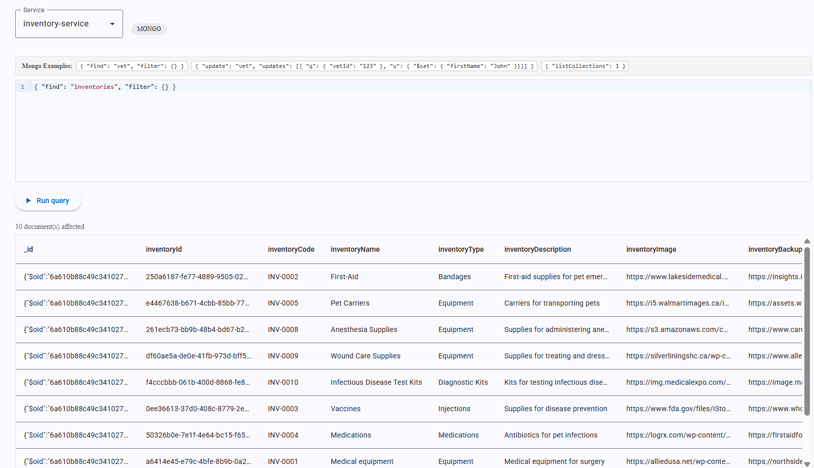
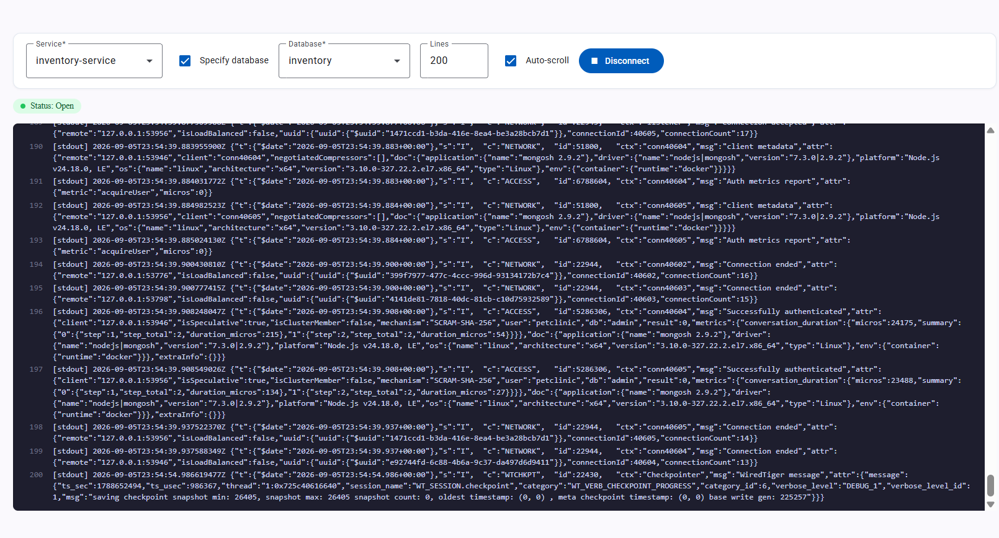

# Pet Clinic exploration Submission

**Name:** Viktoria Zlateva

**Student ID:** 2432820

**Pet Clinic Domain:** inventory 

## Exercise 1: Find a bug and a code smell or 3 code smells in your domain.

Code smell 1:

defaultIfEmpty() is useless here because .then(Mono.just(...)) already returns an OK response when the service completes. If the service fails with an error, defaultIfEmpty() will not handle that error.

Code smell 2:

unecessary flatmap. There's no asynchronous operation is performed inside it. The code manually wraps the result in Mono.just(), so a simple map() would be cleaner.

Code smell 3:

The interface contains an unused method declaration that has been commented out instead of removed. This adds clutter and can confuse about whether the method is still needed. 
> If you could not find a bug, remove the section above and duplicate the below section for each code smell.

## Exercise 2: Make a list of your domain's features.

**List of features:**

- Create a new inventory
- View all inventories
- View an inventory by ID
- Update an inventory
- Delete an inventory
- Search and filter inventories
- Mark an inventory as important
- Add products/supplies to an inventory
- View and search products in an inventory
- Update and delete products
- Move a product from one inventory to another
- Restock low-stock products
- Consume products from inventory
- View low-stock products
- Count the number of products in an inventory
- Manage inventory types
- Generate a PDF report of inventory supplies

## Exercise 3: Run a query on your domain's main table.
{ "find": "inventories", "filter": {} }

## Exercise 4: Look at the logs of your main service.

