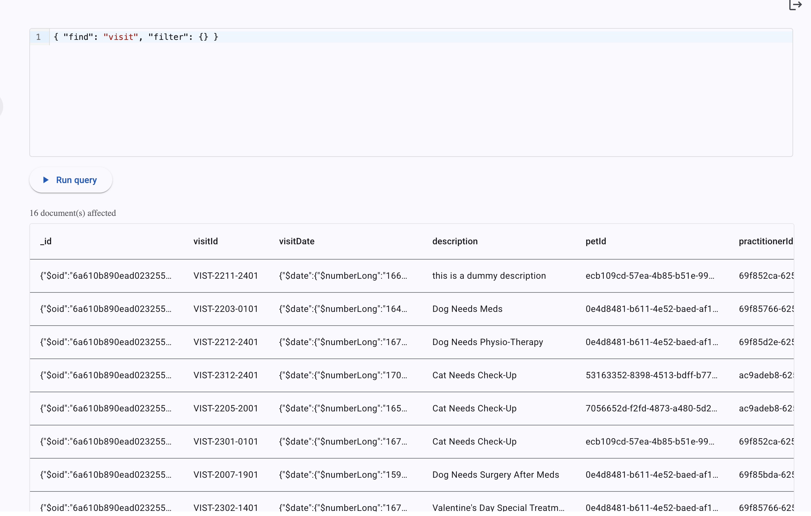
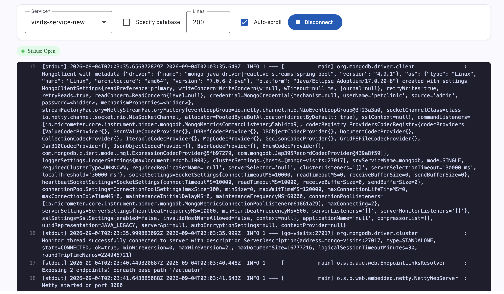

# Pet Clinic exploration Submission

**Name:** Marwa Meskine

**Student ID:** 2432911

**Pet Clinic Domain:** Visit

## Exercise 1: Find a bug and a code smell or 3 code smells in your domain.

**Screenshot of the bug:

**Small description of the bug:
In the frontend when I clicked on book appointment it directed for a split second to login page but right after it showed me that 401 error which is a bug on the frontend part. 
Which means that it would cause trouble for a client to book a visit. To be able to go the login page you need to click the right arrow above.

**Screenshot of the code smell #1 :**

**Small description of the code smell #1:**
In the VisitController there is a code smell because there is a dead code of three methods for emergency 
like for example getEmergencyByEmergencyId which uses the emergencyService in its method but the VisitController doesn't declare
the emergencyService like the visitService. Which means that if it was to be uncommented there would be a broken reference.

## Exercise 2: Make a list of your domain's features.

**List of features:**

- write a prescription 
- send an email
- write a review 

## Exercise 3: Run a query on your domain's main table.

**Screenshot of the query result:**

## Exercise 4: Look at the logs of your main service.

**Screenshot of logs:**

