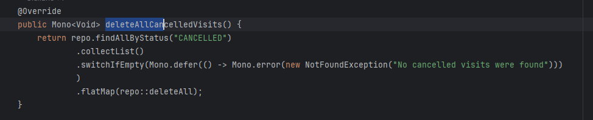
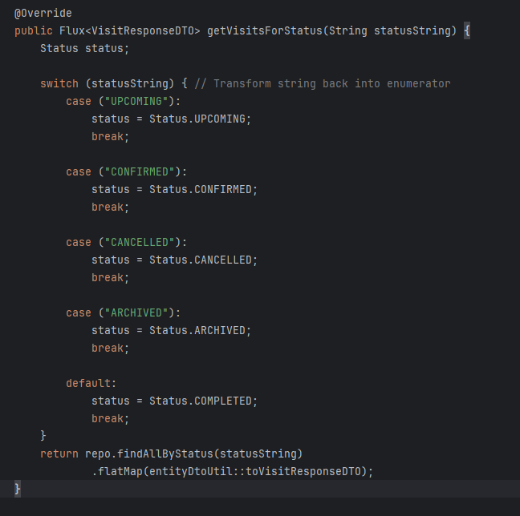
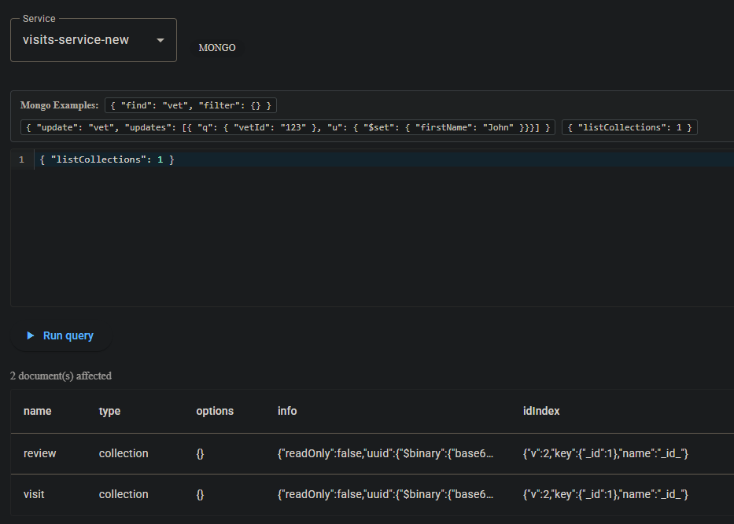
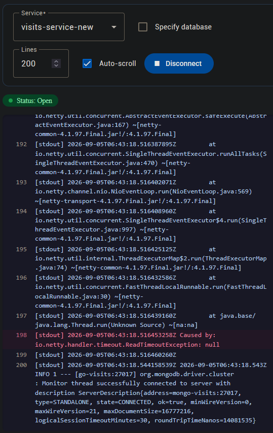

# Pet Clinic exploration Submission

**Name:** William Marcotte

**Student ID:** 2132844

**Pet Clinic Domain:** Visits domain

## Exercise 1: Find a bug and a code smell or 3 code smells in your domain.

**Screenshot of the bug:**

**Small description of the bug:**
If there is no match, collectList() will return an empty list, which still counts as a value. so switchIfEmpty never gets triggered

**Screenshot of the code smell:**

**Small description of the code smell:**
Status status gets assigned a value in the switch, but it never gets used in the return

## Exercise 2: Make a list of your domain's features.

**List of features:**

- Get available timeslots of a vet by id
- Archive visits, and access archive
- download a prescription PDF by visitId

## Exercise 3: Run a query on your domain's main table.

**Screenshot of the query result:**
## Exercise 4: Look at the logs of your main service.

**Screenshot of logs:**

