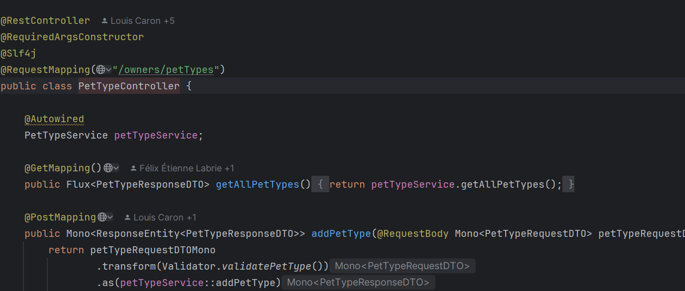
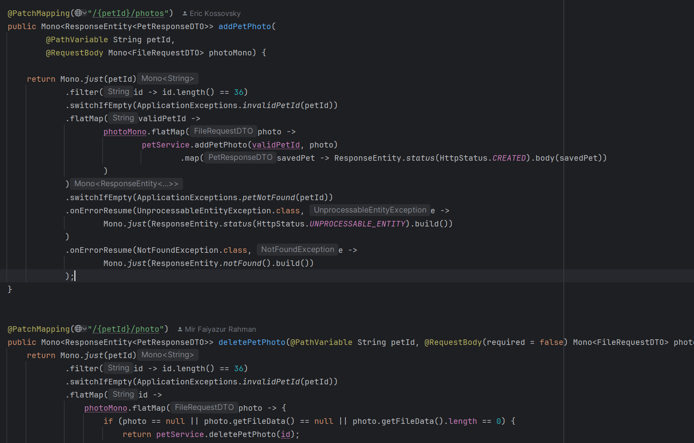
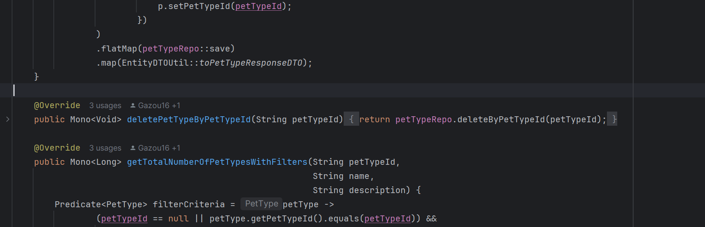
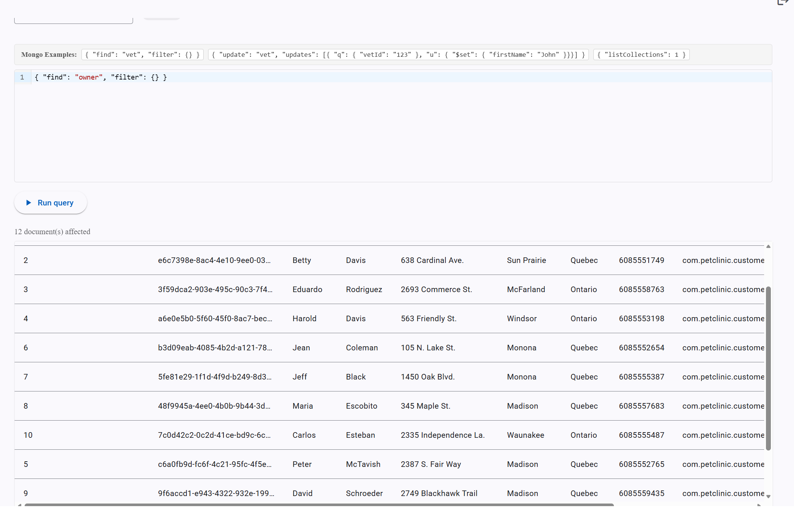
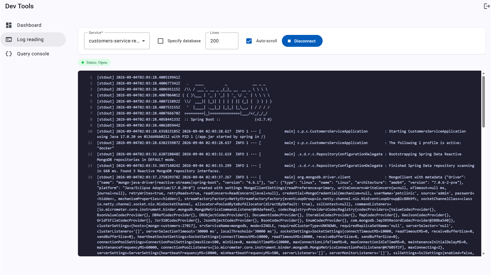

# Pet Clinic exploration Submission

**Name:** Etienne Khalil

**Student ID:** 2230936

**Pet Clinic Domain:** CUST

## Exercise 1: Find a bug and a code smell or 3 code smells in your domain.

**Screenshot of the code smell:**

**Small description of the code smell:** On line 27, PetTypeService uses autowired and isnt private nor final. This happens multiple times across the code

**Screenshot of the code smell:**

**Small description of the code smell:** The 2 PatchMapping methods have very similar names and have very different uses, which isnt proper to naming conventions that should be more precise.

**Screenshot of the code smell:**

**Small description of the code smell:** The DeleteMapping is very simple and doesnt use FlatMap, meaning it isnt really reactive at all.

## Exercise 2: Make a list of your domain's features.

**List of features:**

- Add and delete pet photos
- Have a profile picture for the customer
- You can add pets by by owners in the profile page

## Exercise 3: Run a query on your domain's main table.

**Screenshot of the query result:** 

## Exercise 4: Look at the logs of your main service.

**Screenshot of logs:** 