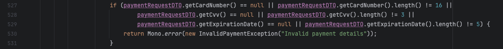
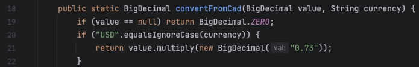
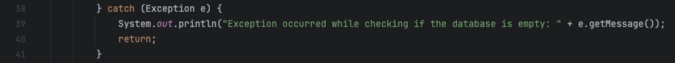
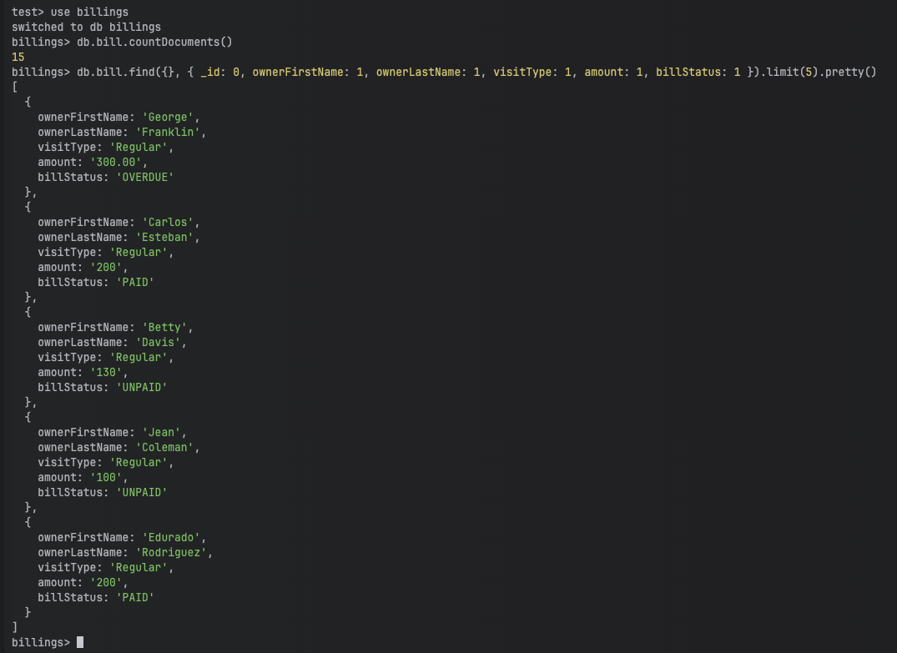
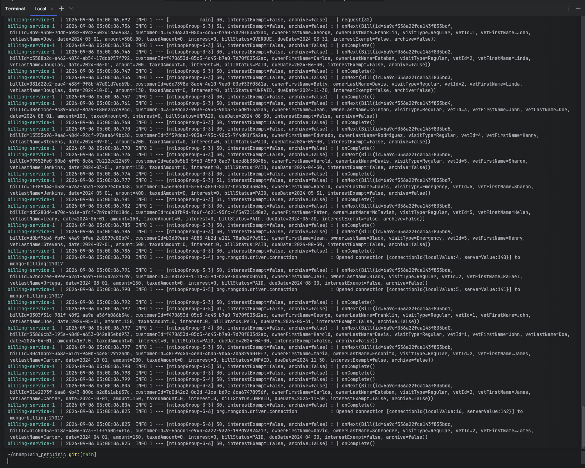

# Pet Clinic exploration Submission

**Name:** Elias Larhdaf

**Student ID:** 2231248

**Pet Clinic Domain:** Billing Service

## Exercise 1: Find a bug and a code smell or 3 code smells in your domain.

**Screenshot of the bug:**

**Small description of the bug:**

The payment validation only checks the length of the card number, CVV, and expiration date. Fake text values with the right length could still pass.

**Screenshot of the code smell:**

**Small description of the code smell:**

The USD exchange rate is written directly in the code as `0.73`. If the exchange rate changes, someone has to edit the Java file instead of changing a setting.

**Screenshot of the code smell:**

**Small description of the code smell:**

This prints an error message directly to the console instead of using the normal logging system. That makes the message harder to manage with the rest of the service logs.

## Exercise 2: Make a list of your domain's features.

**List of features:**

- Create, update, view, and delete bills.
- View bills by customer, vet, owner, visit type, status, month, date range, due date range, and amount range.
- Pay a customer bill and update the bill status.
- Calculate interest, total amount, and current balance for bills.
- Archive bills, exempt bills from interest, and generate bill PDFs.

## Exercise 3: Run a query on your domain's main table.

**Screenshot of the query result:**

## Exercise 4: Look at the logs of your main service.

**Screenshot of logs:**

