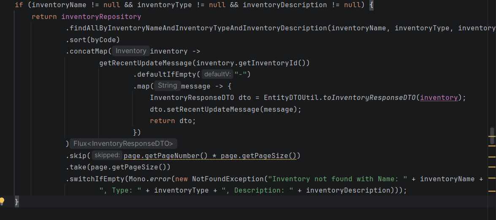
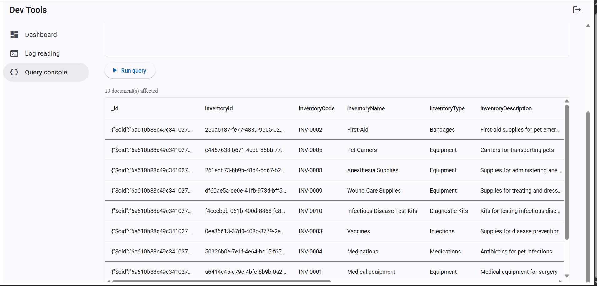
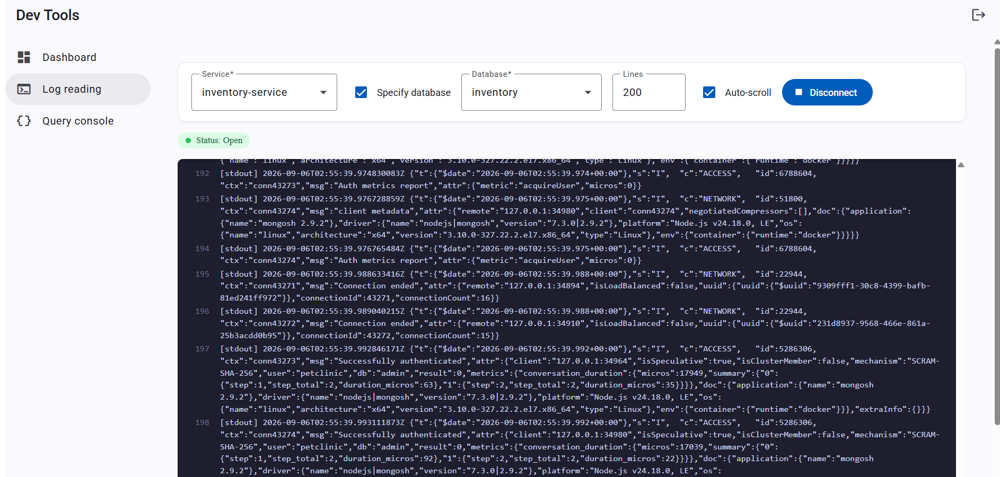

# Pet Clinic exploration Submission

**Name:** Dennis Kanatselis

**Student ID:** 2232694

**Pet Clinic Domain:** inventory 

## Exercise 1: Find a bug and a code smell or 3 code smells in your domain.

 
Incorrect return using name instead of description

 
Having inventory code in service mixes presentation with business logic

## Exercise 2: Make a list of your domain's features.

**List of features:**

-Get low‑stock products 
-Generate a PDF supply report
-Filter products by fields

## Exercise 3: Run a query on your domain's main table.

 
## Exercise 4: Look at the logs of your main service.

 
