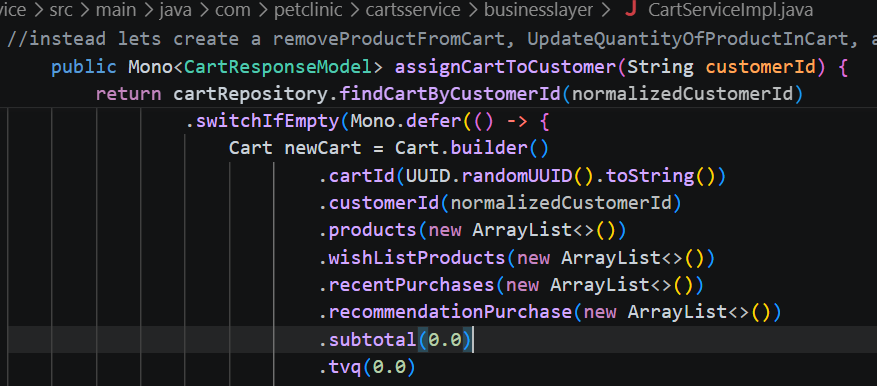
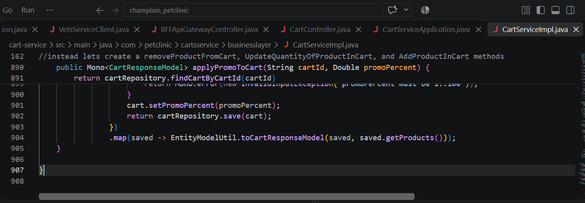
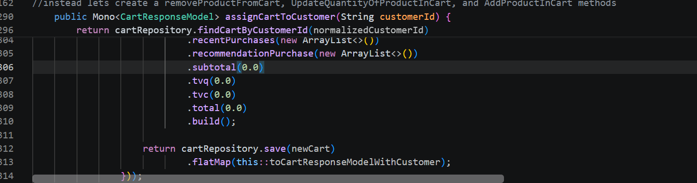
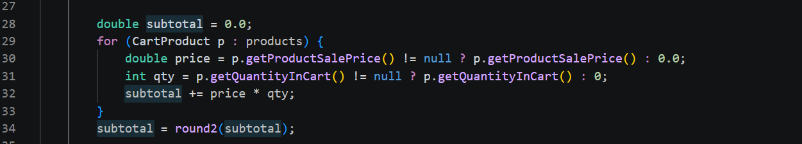
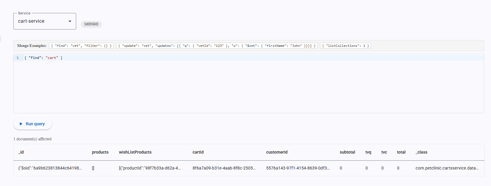
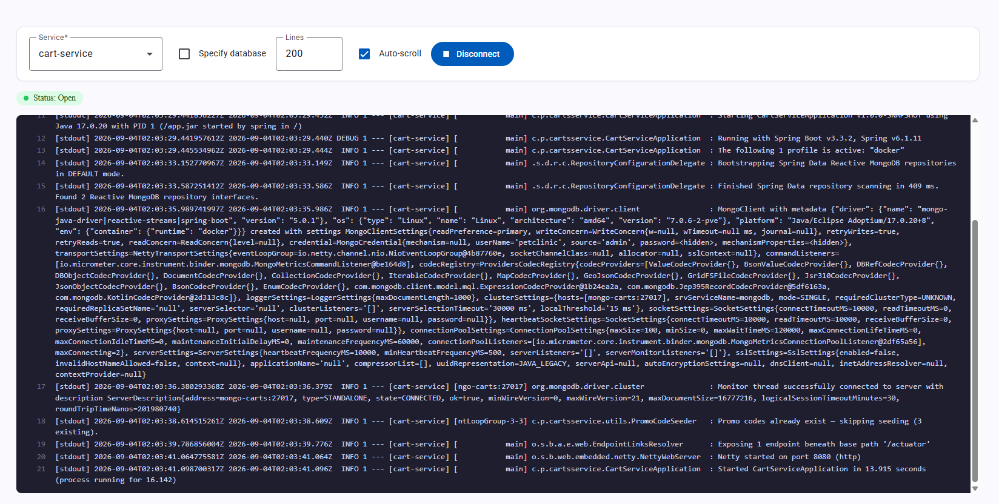

# Pet Clinic exploration Submission

**Name:** Youcef Si-Ramdane

**Student ID:** 23330097

**Pet Clinic Domain:** Cart

## Exercise 1: Find a bug and a code smell or 3 code smells in your domain.

**Screenshot of the bug:**

**Small description of the code smell:**

Subtotal gets set to 0.0 when a cart is created, but nothing ever updates it afterward. So the stored value is just wrong/outdated once you add items.

**Screenshot of the code smell:**

**Small description of the code smell:**

One class is doing way too much. CartServiceImpl has 907 lines. Hard to read and hard to debug.

**Screenshot of the code smell:**

**Small description of the code smell:**

 CartServiceImpl and EntityModelUtil both compute the same thing. The first one computes subtotal with a stream and no null-checks, the other with a for loop that does null-check. If you fix a bug in one, the other still has it.

## Exercise 2: Make a list of your domain's features.

**List of features:**

- Cart management
- Wishlist management
- Pricing & promotions

## Exercise 3: Run a query on your domain's main table.

**Screenshot of the query result:**

## Exercise 4: Look at the logs of your main service.

**Screenshot of logs:**

