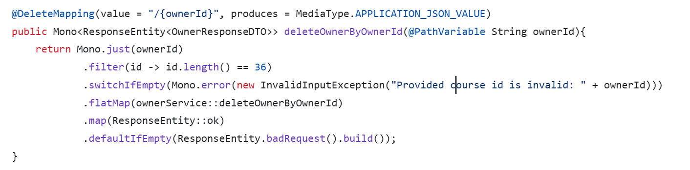
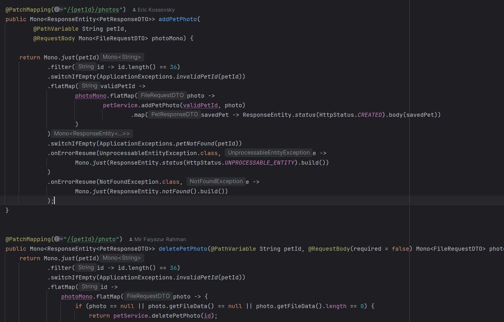
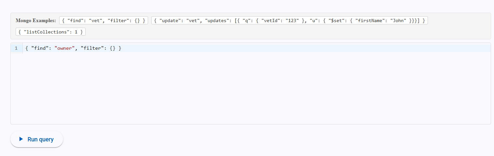
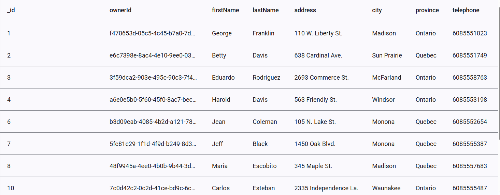
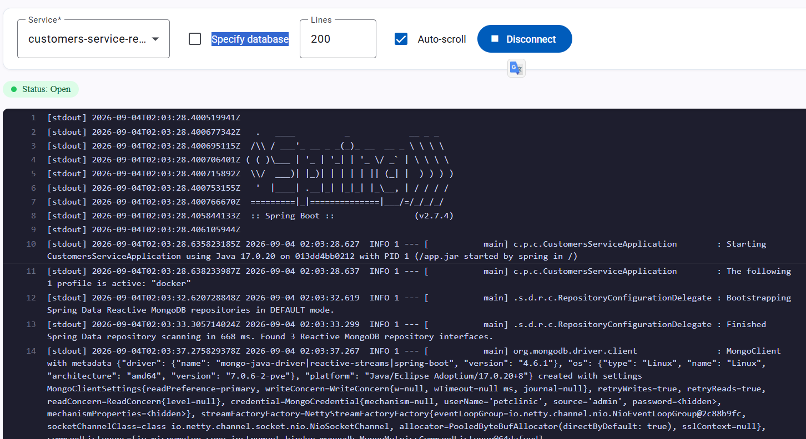

# Pet Clinic exploration Submission

**Name:** Ilian Adeleke

**Student ID:** 2330261

**Pet Clinic Domain:** Customer 

## Exercise 1: Find a bug and a code smell or 3 code smells in your domain.

**Screenshot of the bug:**

customers-service-reactive/src/main/java/com/petclinic/customersservice/presentationlayer/OwnerController.java

**Small description of the bug:**
The errorr handling return the wrong comments for invalid id. The description of the error should be (Provided owener id is invalid: " + ownerId) but currently it is (Provided course id is invalid" + ownerId)

> If you could not find a bug, remove the section above and duplicate the below section for each code smell.

**Screenshot of the code smell:**

**Small description of the code smell:**
The mappping for two different features is almost the same exept one include ''/photos'' and one is ''/photo'' i doubt the user would no that so we need to optimize that mapping.

## Exercise 2: Make a list of your domain's features.

**List of features:**

- Pet Status Tracking (Active / Inactive / Deceased)
- Upload and View Pet Medical & Vaccination Records
- Emergency Contact & Co-Owner Management

## Exercise 3: Run a query on your domain's main table.

**Screenshot of the query result:**

## Exercise 4: Look at the logs of your main service.

**Screenshot of logs:**

