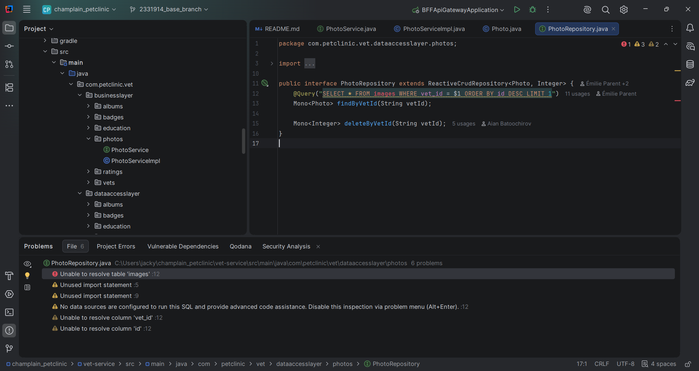
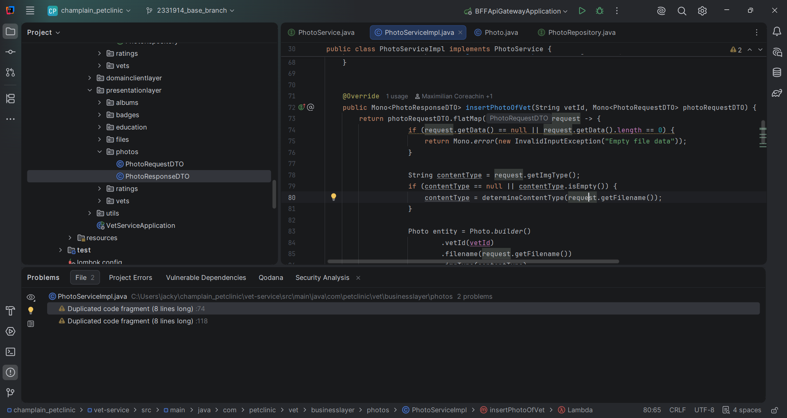
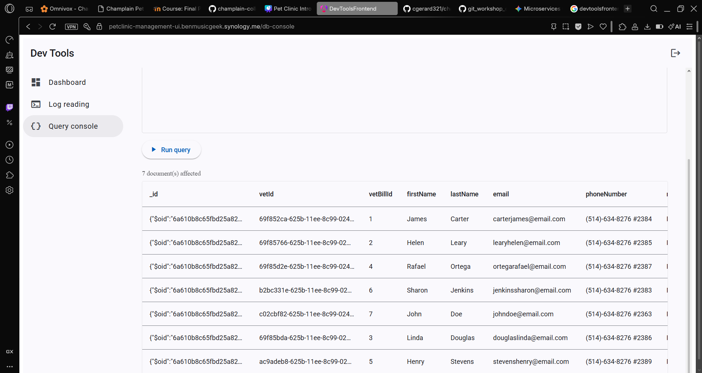
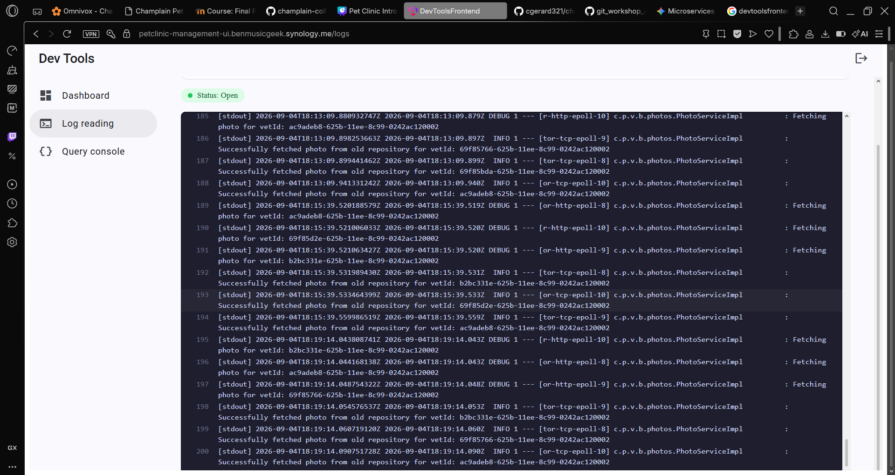

# Pet Clinic exploration Submission

**Name:** Jacky Bolap

**Student ID:** 2331914

**Pet Clinic Domain:** VET

## Exercise 1: Find a bug and a code smell or 3 code smells in your domain.

The system is unable to locate the 'images' table

There is a redundant code line

## Exercise 2: Make a list of your domain's features.

**List of features:**

- You can search for a photo by a vet id
- The program can determine the content type of the photo (gif, jpeg, etc...)
- The program can input and return default photo's if the photo or the vet can't be found

## Exercise 3: Run a query on your domain's main table.

**Screenshot of the query result:**

**Screenshot of logs:**

