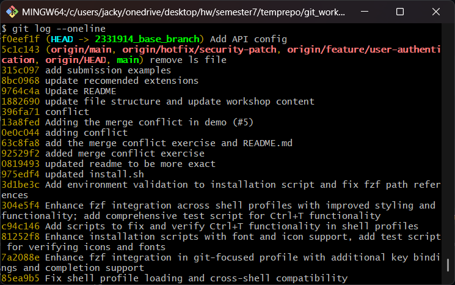
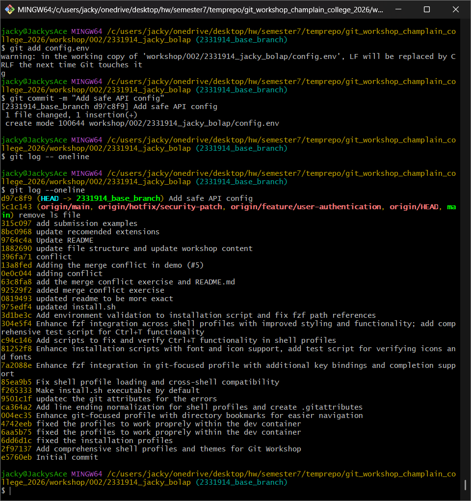
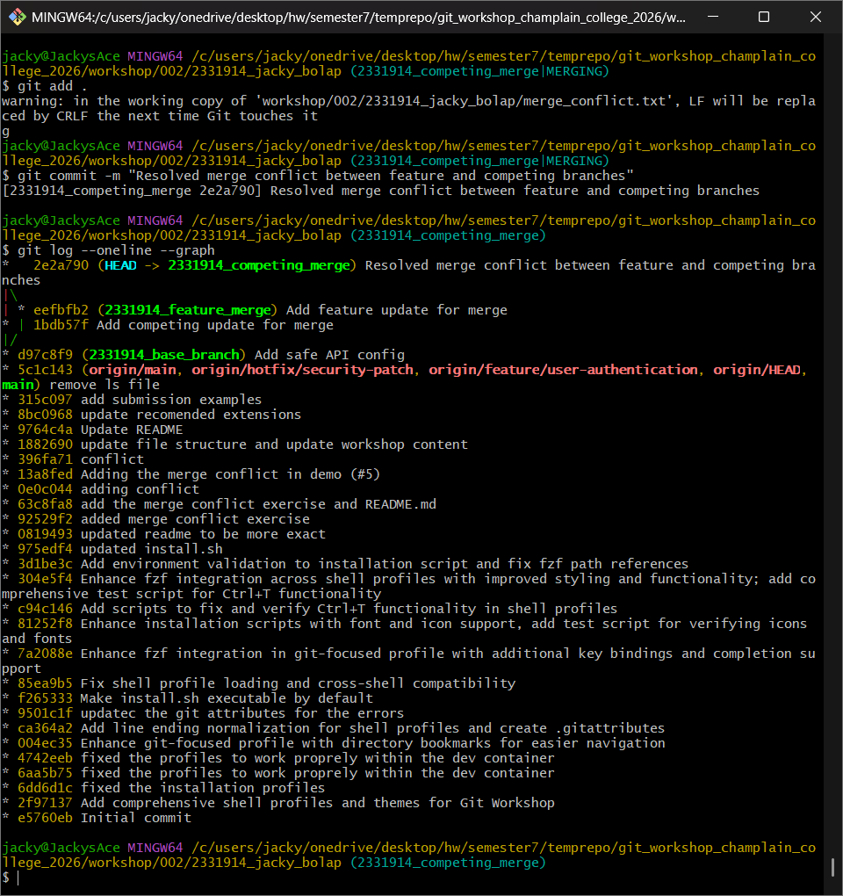
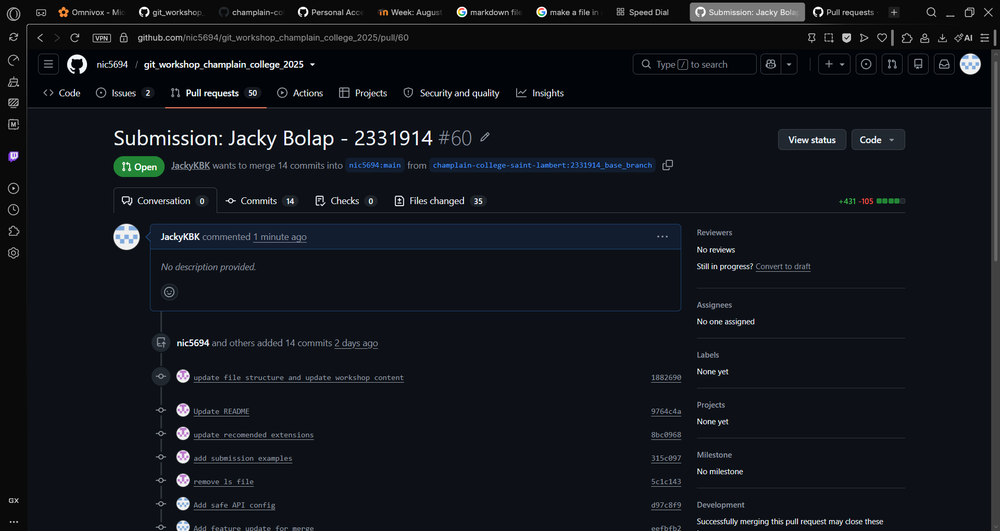

# Git Lab Submission

**Name:** Jacky Bolap
**Student ID:** 2331914

## Exercise 1: Local Revert

## Exercise 2: Merge Resolution

## Exercise 3: Rebase Resolution

**Original Feature Commit Hash:** `245da7c`
**New Feature Commit Hash:** `f65bce5`

[Rebase Commit Graph](rebase_graph.png)

## Exercise 4: Pull Request

