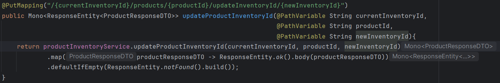
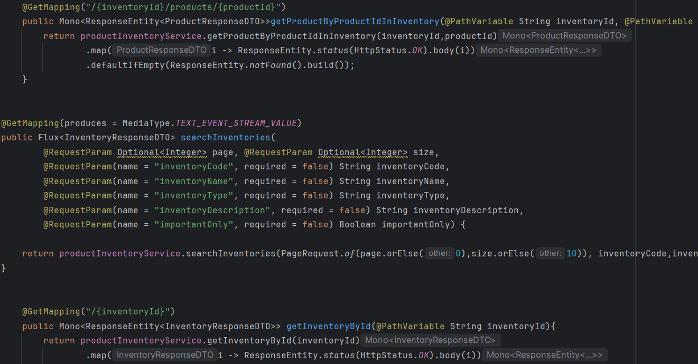
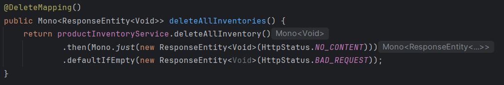
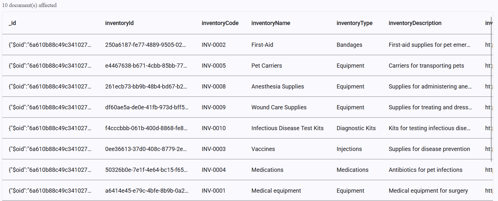
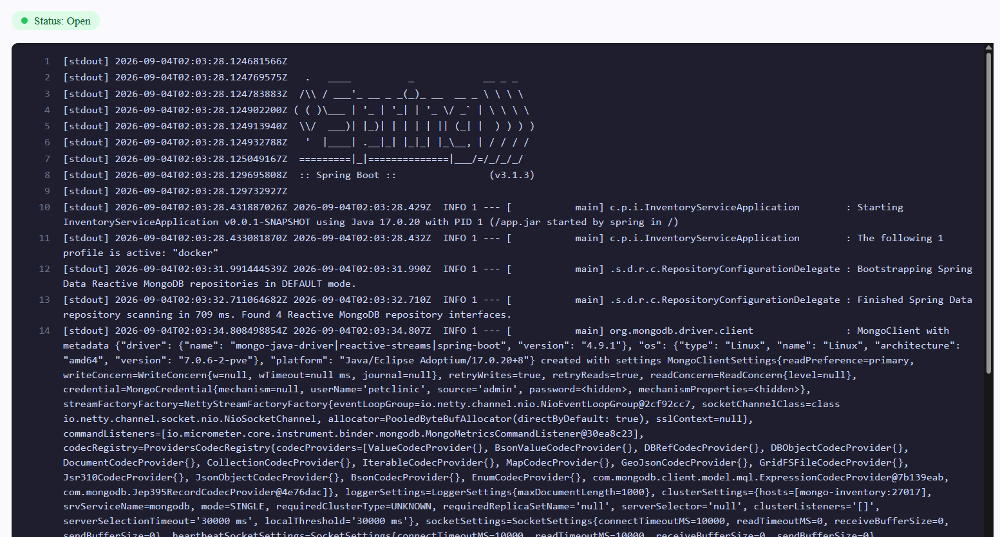

# Pet Clinic exploration Submission

**Name:** Lazaro E. Sagarra Valdes

**Student ID:** 2430745

**Pet Clinic Domain:** INVT

## Exercise 1: Find a bug and a code smell or 3 code smells in your domain.

**Screenshot of the first code smell:**

**Small description of the code smell:**
It would be better to use @PatchMapping over @PutMapping since this method only updates the inventoryId of a give product

**Screenshot of the second code smell:**

**Small description of the code smell:**
The indentation of the "searchInventories()" method clashes with the rest of the controller

**Screenshot of the second code smell:**

**Small description of the code smell:**
This method's @DeleteMapping does not have a path at all

## Exercise 2: Make a list of your domain's features.

**List of features:**

- The inventory service can return what products are currently low on stock
- The inventory service can return a list of products filtered by their productName, their productDescription or their status
- The inventory service can create a new inventory type
- The inventory service can delete all products inside a specified inventory

## Exercise 3: Run a query on your domain's main table.

**Screenshot of the query result:**

## Exercise 4: Look at the logs of your main service.

**Screenshot of logs:**

