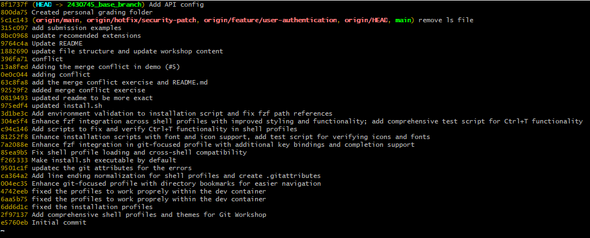
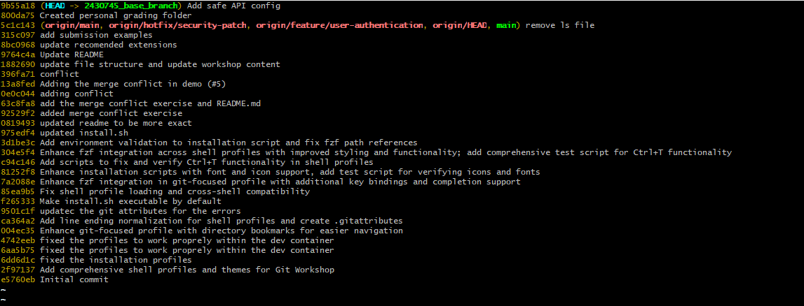
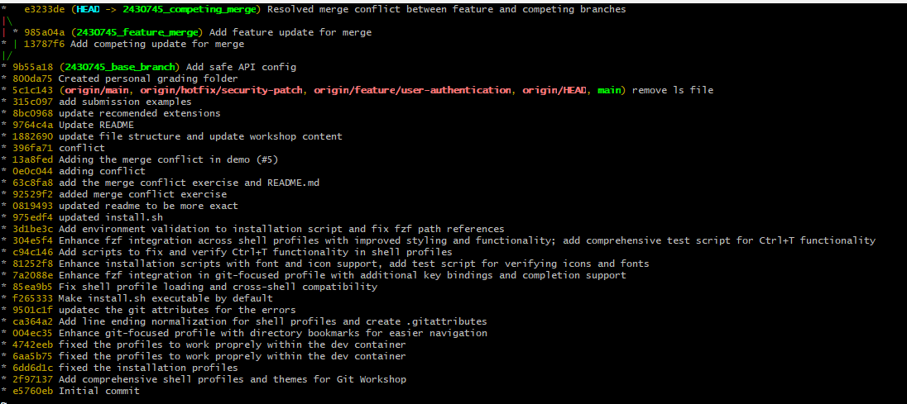
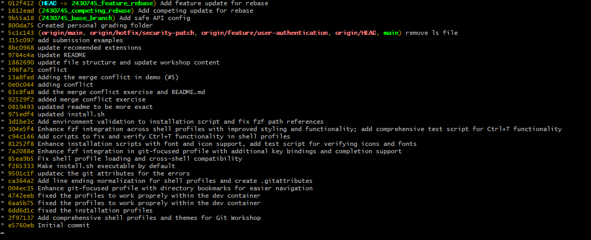
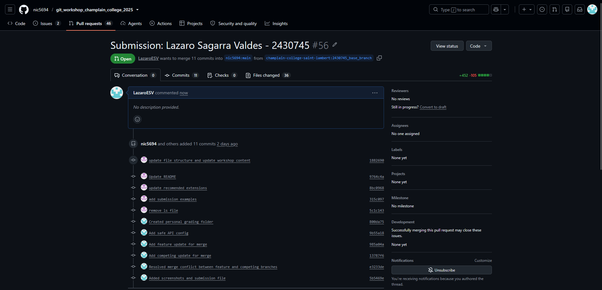

# Git Lab Submission

**Name:** Lazaro E. Sagarra Valdes
**Student ID:** 2430745

## Exercise 1: Local Revert







## Exercise 2: Merge Resolution




## Exercise 3: Rebase Resolution

**Original Feature Commit Hash:** `2d42201`
**New Feature Commit Hash:** 012f412




## Exercise 4: Pull Request



```

---