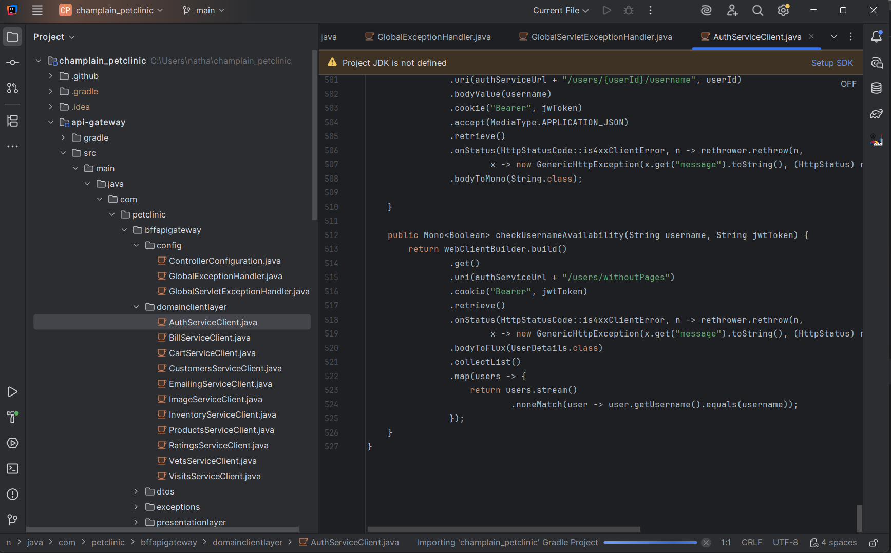
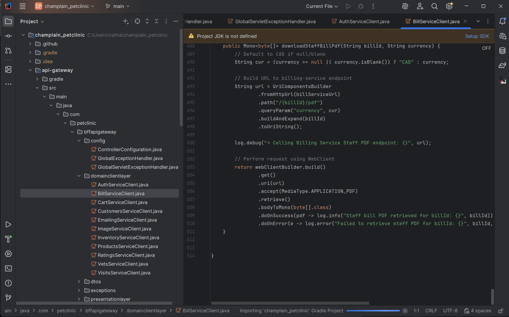
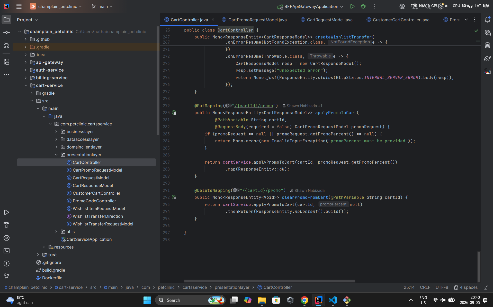
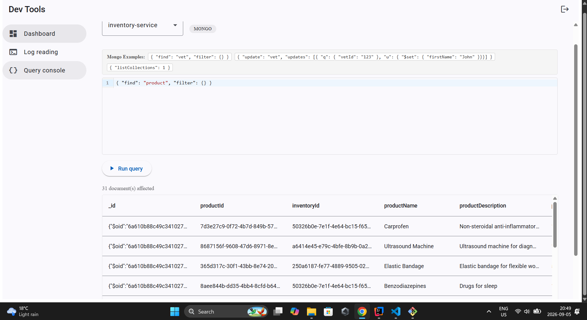
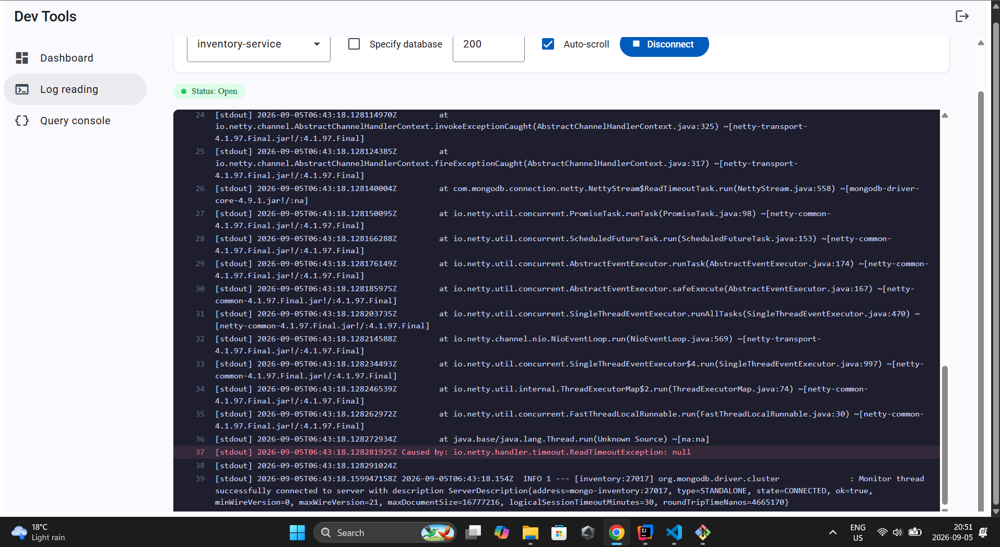

# Pet Clinic exploration Submission

**Name:** Nathan Toko

**Student ID:** 2431196

**Pet Clinic Domain:** Inventory

## Exercise 1: Find a bug and a code smell or 3 code smells in your domain.

> If you could not find a bug, remove the section above and duplicate the below section for each code smell.

**Screenshot of the code smell:**

**Small description of the code smell:**

500 lines not optimal

**Screenshot of the code smell:**

**Small description of the code smell:**

500 lines again, not optimal

**Screenshot of the code smell:**

**Small description of the code smell:**

300 lines not optimal

## Exercise 2: Make a list of your domain's features.

**List of features:**

- feature 1
Add an item in the inventory
- feature 2
Filter Inventory
- feature 3
Paginate inventory results
## Exercise 3: Run a query on your domain's main table.
{ "find": "product", "filter": {} }

**Screenshot of the query result:**

## Exercise 4: Look at the logs of your main service.

**Screenshot of logs:**
