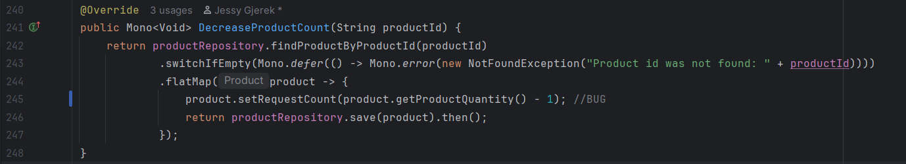
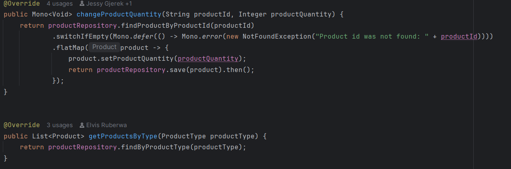
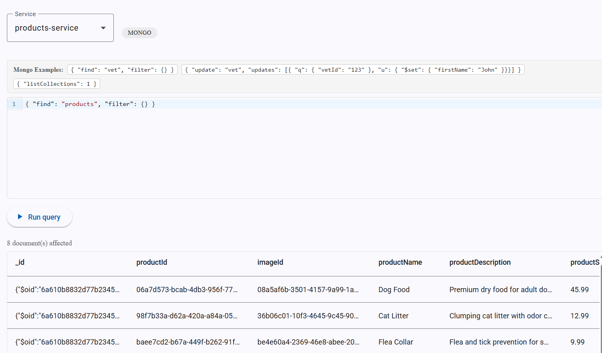
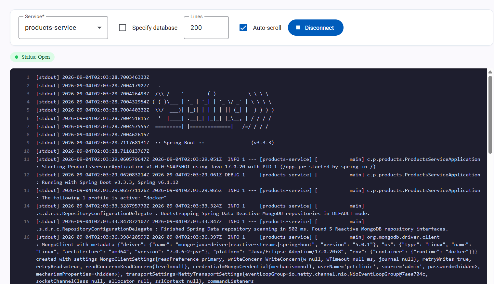

# Pet Clinic exploration Submission

**Name:** [Ryan Liautaud]

**Student ID:** [2431277]

**Pet Clinic Domain:** [Products]

## Exercise 1: Find a bug and a code smell or 3 code smells in your domain.

**Screenshot of the bug:**

**Small description of the bug:**
Calculation to decrease the product count, but sets the request count instead of the product count to the new value.
> If you could not find a bug, remove the section above and duplicate the below section for each code smell.

**Screenshot of the code smell:**

**Small description of the code smell:**
Mixing reactive coding with blocking in the ProductServiceImpl class, which is inconsistent and can cause issues.
## Exercise 2: Make a list of your domain's features.

**List of features:**

- feature 1: User ratings/reviews for products
- feature 2: Product filters when browsing through the catalog
- feature 3: Product availability (Pre-order, in-stock or out of stock)

## Exercise 3: Run a query on your domain's main table.

**Screenshot of the query result:**

## Exercise 4: Look at the logs of your main service.

**Screenshot of logs:**
