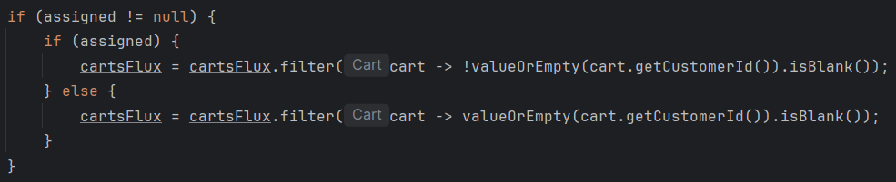
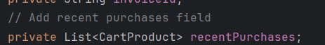
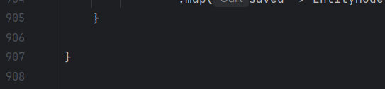
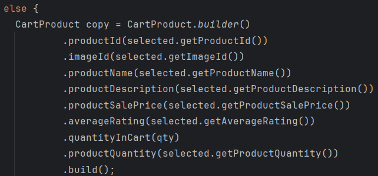
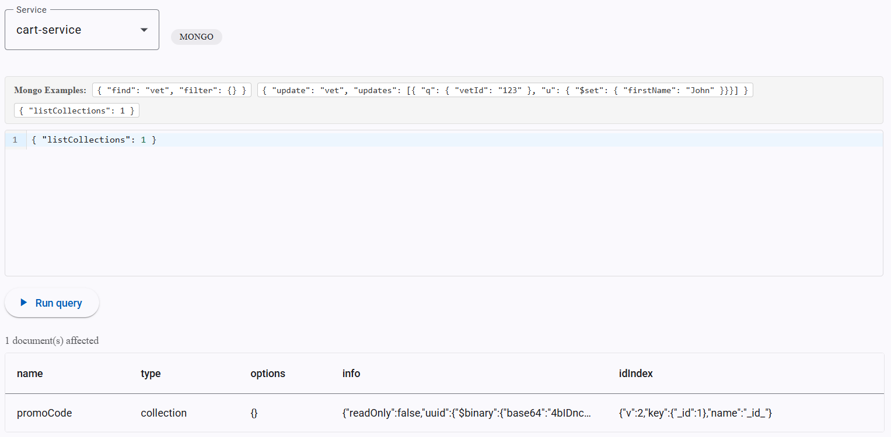
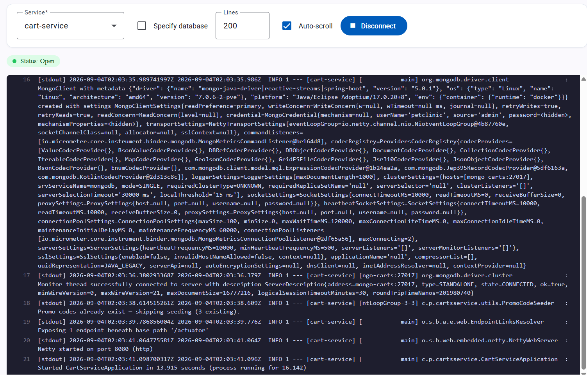

# Pet Clinic exploration Submission

**Name:** Andre Lamontagne

**Student ID:** 2431521

**Pet Clinic Domain:** Carts

## Exercise 1: Find a bug and a code smell or 3 code smells in your domain.

Instead of two if checks, you can use one simple condition and make it more reactive.

The comment should have been removed when the modification was made and it should have been marked as a TODO comment at first.

This file is way too big (less than 500 lines ideally).

CartProduct is built multiple times with almost the exact same fields. It could be a helper method.

## Exercise 2: Make a list of your domain's features.

**List of features:**

- add a product to your wish list.
- find, save and apply promo codes to your cart items.
- retrieve a list of recommended purchases.

## Exercise 3: Run a query on your domain's main table.

## Exercise 4: Look at the logs of your main service.

