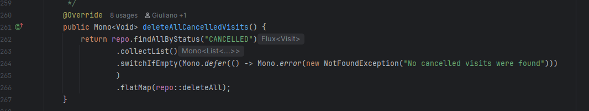
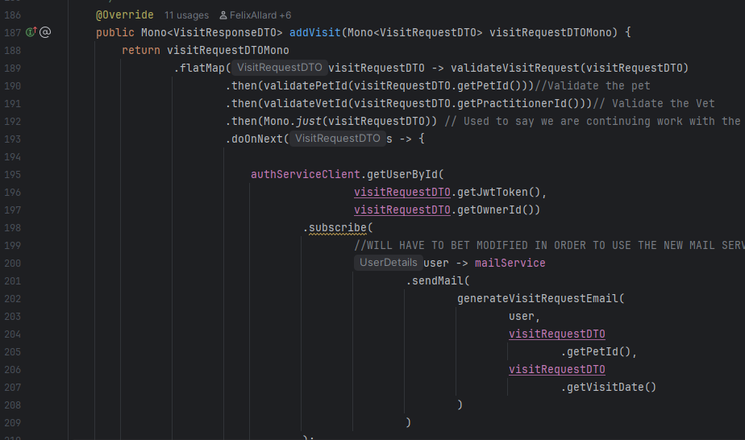
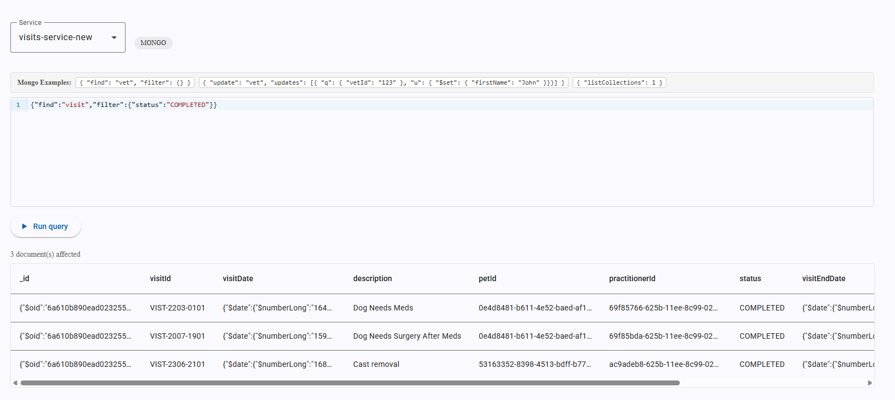
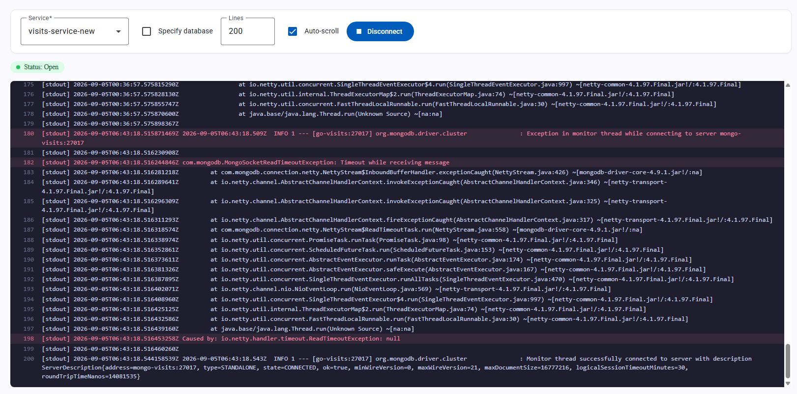

# Pet Clinic exploration Submission

**Name:** Noah Bouffard

**Student ID:** 2431848

**Pet Clinic Domain:** Visits (VIST)

## Exercise 1: Find a bug and a code smell or 3 code smells in your domain.

****

**Small description of the bug: collectList() returns an empty list, so switchIfEmpty() never runs. The endpoint incorrectly succeeds when no cancelled visits exist. **

****

**Small description of the code smell: Calling subscribe() inside the reactive pipeline creates a separate operation. Email errors are ignored, and the visit may finish before the email is sent.**

## Exercise 2: Make a list of your domain's features.

**List of features:**

- View visits by pet or veterinarian
- Create, update, and delete visits
- View and search all visits

## Exercise 3: Run a query on your domain's main table.

****

## Exercise 4: Look at the logs of your main service.

****
