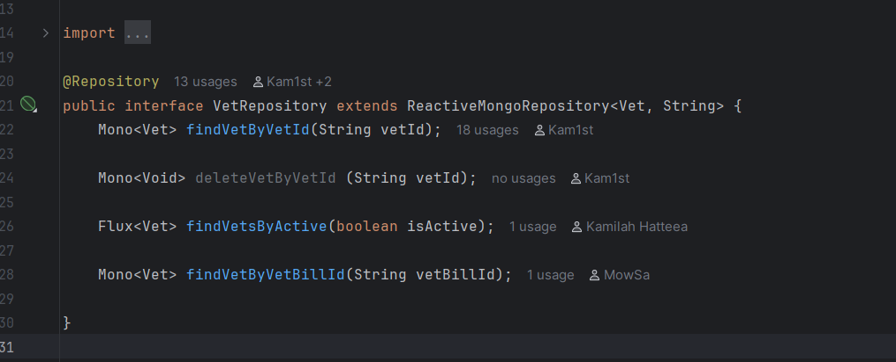
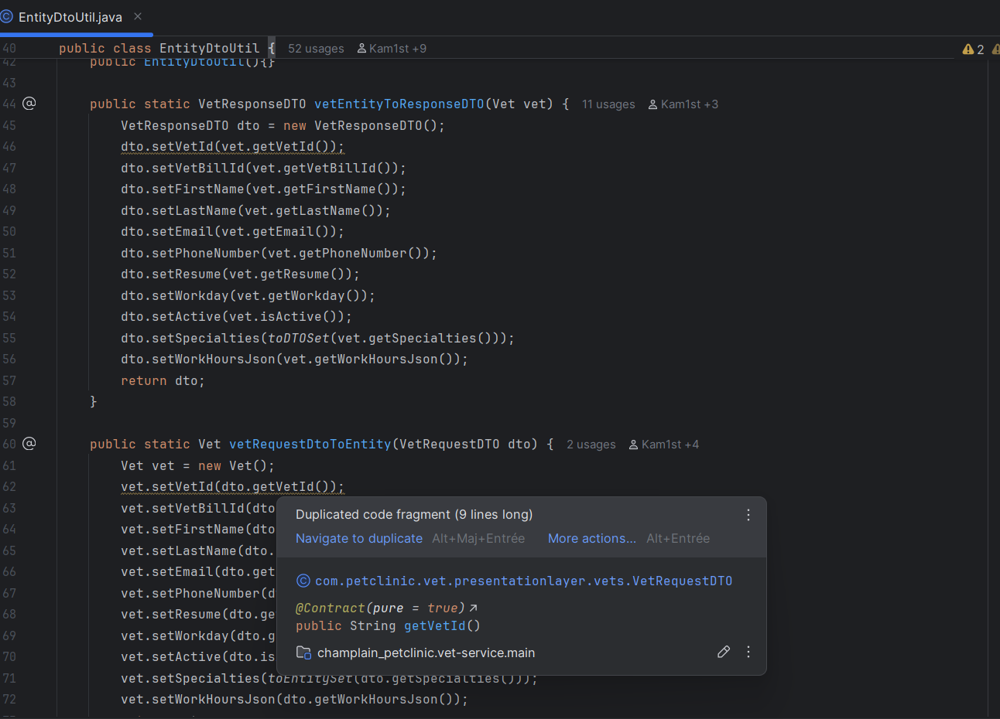
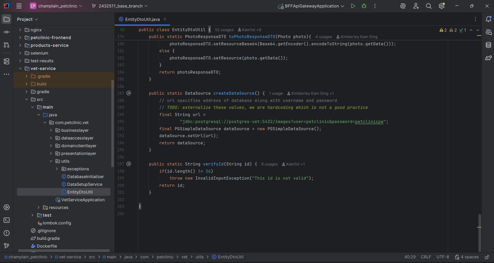
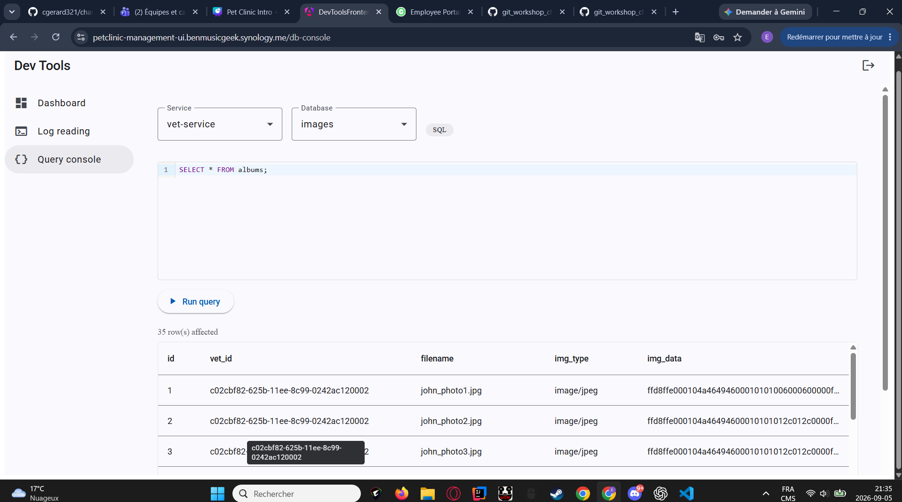
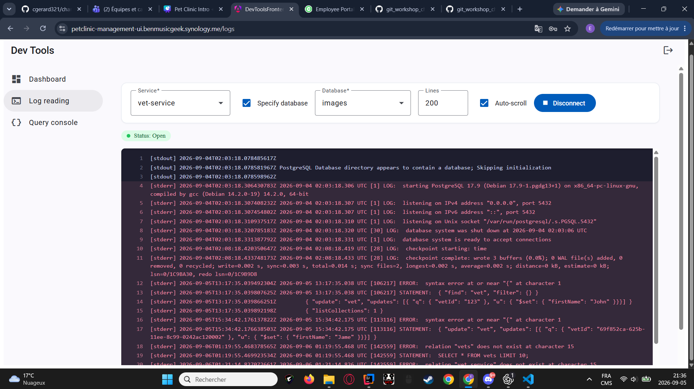

# Pet Clinic exploration Submission

**Name:** Elias Ibaliden

**Student ID:** 2432511

**Pet Clinic Domain:** VETS

## Exercise 1: Find a bug and a code smell or 3 code smells in your domain.

**Screenshot of the code smell:**

**Small description of the code smell:**
The VetRepository contains a deleteVetByVetId method that is not used anywhere in the service. This is a code smell because unused methods make the interface harder to understand and may indicate leftover dead code from an older implementation.

**Screenshot of the code smell:**

**Small description of the code smell:**
IntelliJ identifies a duplicated code fragment in EntityDtoUtil. The class manually copies many of the same fields between Vet, VetRequestDTO, and VetResponseDTO. This is a code smell because repeated mapping logic makes the code harder to maintain. If a field changes, developers may need to update multiple similar code blocks.

**Screenshot of the code smell:**

**Small description of the code smell:**
The createDataSource method hardcodes the PostgreSQL database URL, username, and password directly in the Java source code. This is a code smell because configuration values and credentials should not be stored in code. It makes the application harder to configure for different environments and could expose sensitive information if the repository is shared.
## Exercise 2: Make a list of your domain's features.

**List of features:**

- feature 1
View List of Veterinarians

- feature 2
View veterinarian profile

- feature 3
Add new veterinarian

## Exercise 3: Run a query on your domain's main table.

**Screenshot of the query result:**

## Exercise 4: Look at the logs of your main service.

**Screenshot of logs:**
