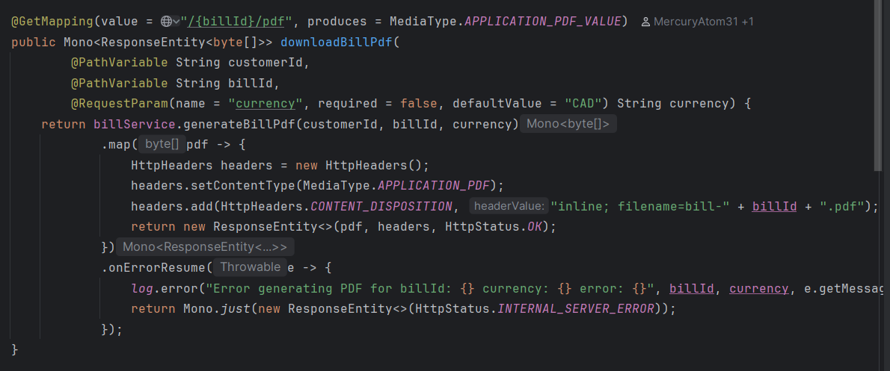
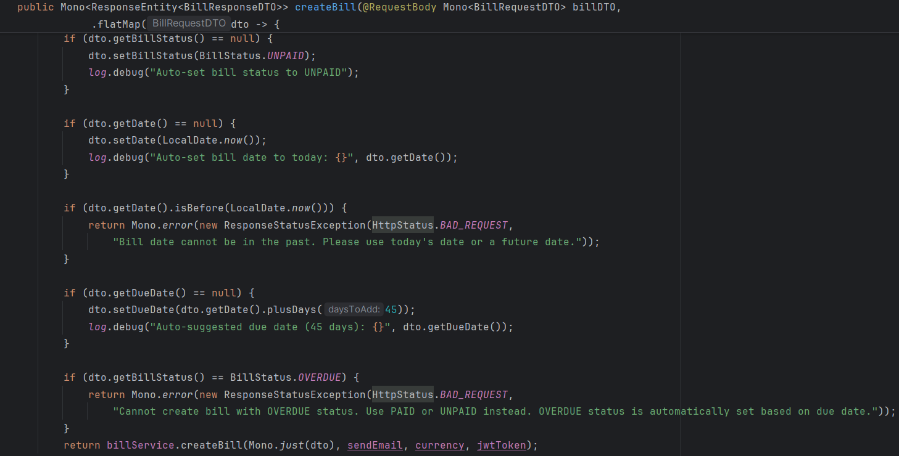
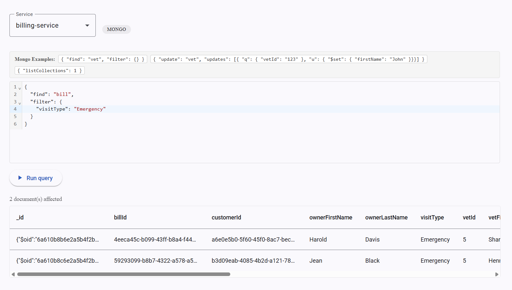
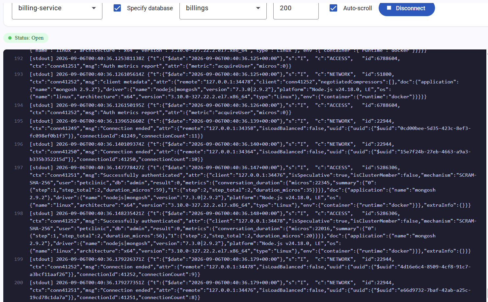

# Pet Clinic exploration Submission

**Name:** Kyle Galbraith

**Student ID:** 2432714

**Pet Clinic Domain:** Billing(BILL)

## Exercise 1: Find a bug and a code smell or 3 code smells in your domain.

**Screenshot of the bug:**

**Small description of the bug: Converts every error to a 500**

> If you could not find a bug, remove the section above and duplicate the below section for each code smell.

**Screenshot of the code smell:**

**Small description of the code smell: The controller for creating bill is handling some bussiness logic (not allowing OVERDUE status and not allowing date in the past)**

## Exercise 2: Make a list of your domain's features.

**List of features:**

- Generate a bill pdf
- Update bill(ex. change status of bill)
- Calculate interest of bill

## Exercise 3: Run a query on your domain's main table.

**Screenshot of the query result:**

## Exercise 4: Look at the logs of your main service.

**Screenshot of logs:**
