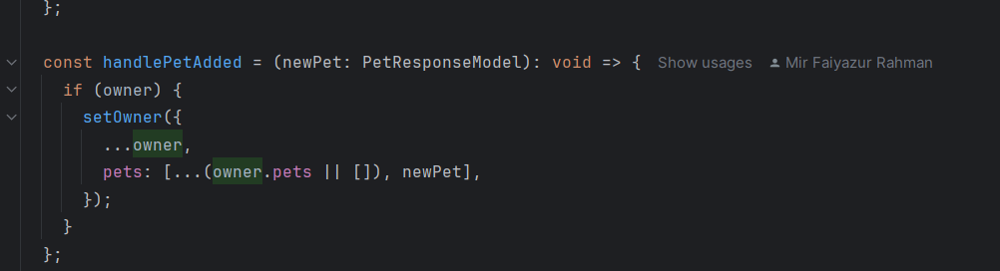
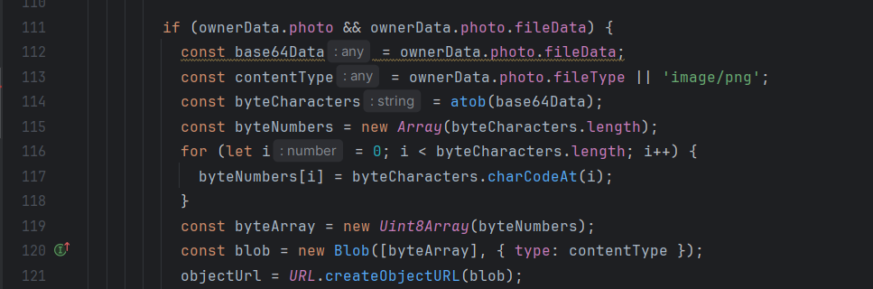
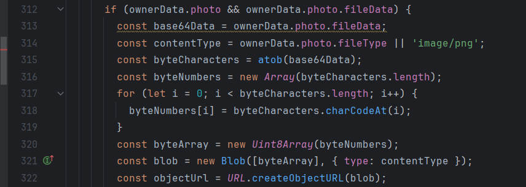
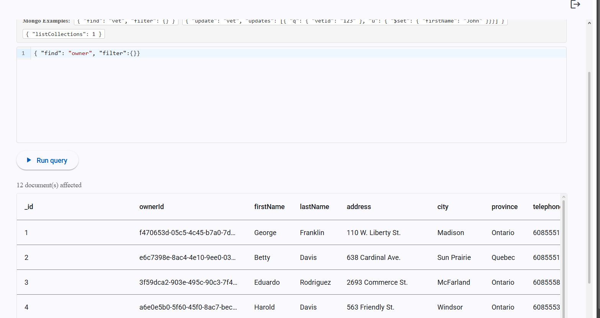
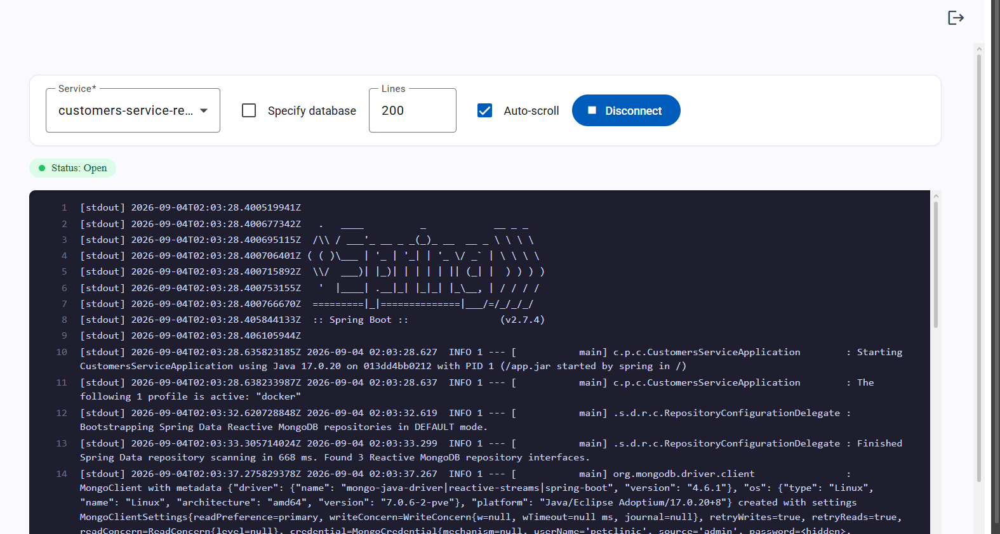

# Pet Clinic exploration Submission

**Name:** Adam Benikhlef

**Student ID:** 2432951

**Pet Clinic Domain:** Customer

## Exercise 1: Find a bug and a code smell or 3 code smells in your domain.

**Screenshot of the bug:**

**Small description of the bug:**

> handlePetAdded uses the current owner value directly. If pets are added quickly, it can use stale data and overwrite a previously added pet.

**Screenshot of the code smell:**

**Small description of the code smell:**

> The Base64-to-image conversion code is long and should be moved into a reusable helper function.

**Screenshot of the second code smell:**

**Small description of the second code smell:**

> The same Base64-to-image conversion logic is duplicated, making the code harder to maintain.

## Exercise 2: Make a list of your domain's features.

**List of features:**

- Add a profile picture
- Delete a pet
- Display pets in the owner profile

## Exercise 3: Run a query on your domain's main table.

**Screenshot of the query result:**

## Exercise 4: Look at the logs of your main service.

**Screenshot of logs:**

