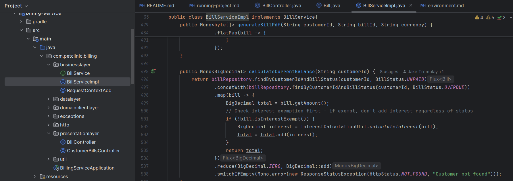
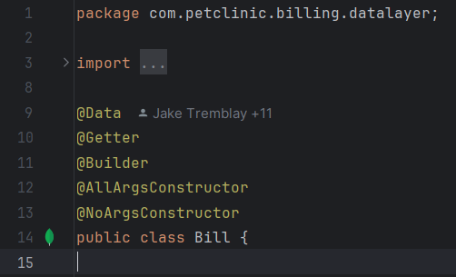
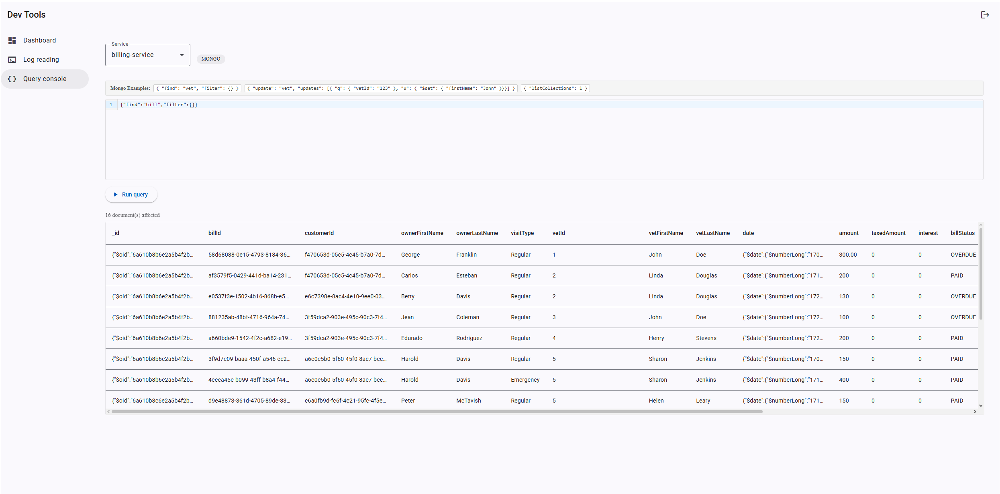
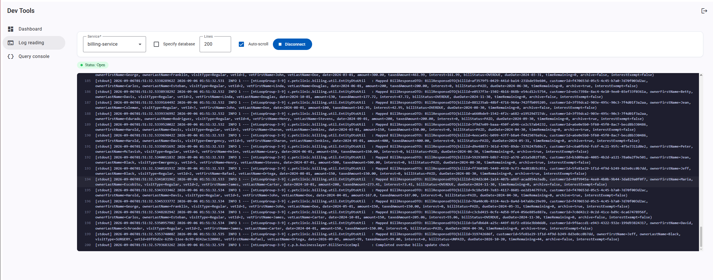

# Pet Clinic exploration Submission

**Name:** Maxime Bergeron

**Student ID:** 2433090

**Pet Clinic Domain:** Billing

## Exercise 1: Find a bug and a code smell or 3 code smells in your domain.

**Screenshot of the bug:** 

**Small description of the bug:**
When requesting the current balance of a customer that does not exist, the billing service can return a balance of `0` instead of returning a `404 Not Found`. This happens because the balance calculation starts at zero, so it cannot tell the difference between a customer with no unpaid bills and a customer that does not exist.

**Screenshot of the code smell:**

**Small description of the code smell:**
The `Bill` class uses both `@Data` and `@Getter`. The `@Data` annotation already generates getters, so using `@Getter` as well is unnecessary and redundant.

## Exercise 2: Make a list of your domain's features.

**List of features:**

- Create a bill
- View all bills
- View a bill by its ID
- Update a bill
- Delete a bill
- View bills for a specific customer
- View bills for a specific veterinarian
- View paid, unpaid, and overdue bills
- Filter bills by amount
- Filter bills by date
- Calculate a customer's current balance
- Process bill payments
- Generate bill PDFs
- Archive bills

## Exercise 3: Run a query on your domain's main table.

**Screenshot of the query result:**

## Exercise 4: Look at the logs of your main service.

**Screenshot of logs:**
